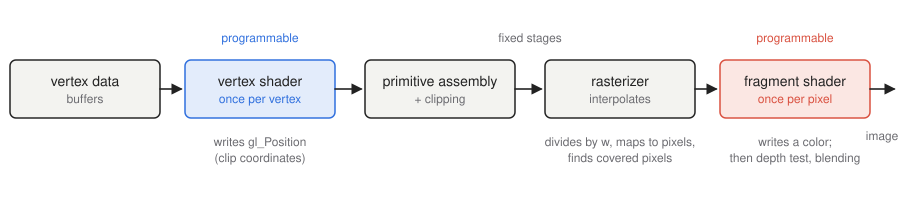
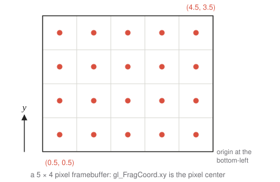

# 1 · The rendering pipeline and GLSL

**You will learn:** the stages a triangle passes through on its way to the screen, which of those stages you program, and enough GLSL to write both kinds of shaders.

**Demo:** [01 · Hello, triangle](../demos/01-hello-triangle.html)

---

## 1.1 From vertices to pixels

A GPU does not draw "a cube" or "a sphere". It draws **triangles** (also lines and points), and it draws them fast because it runs the same small program on thousands of vertices or pixels at once. Every frame of a WebGL program pushes data through a fixed sequence of stages:



1. **Vertex data.** Your program uploads arrays of per-vertex values (positions, normals, colors, texture coordinates) into GPU **buffers**. It uploads them once and draws them many times.
2. **Vertex shader** (programmable). Runs **once per vertex**. Its one required job is to write `gl_Position`, the vertex's position in **clip coordinates** (§1.2). It can also compute values to hand on, such as a color or a transformed normal.
3. **Primitive assembly and clipping.** Consecutive vertices, or vertices chosen by an index list, are grouped into triangles. Triangles outside the view volume are discarded; triangles crossing its boundary are cut.
4. **Rasterization.** Each triangle is mapped to the screen, and the GPU decides which pixel centers it covers. For every covered pixel it **interpolates** the vertex shader's outputs from the triangle's three corners. The result is a **fragment**: a candidate pixel carrying interpolated data.
5. **Fragment shader** (programmable). Runs **once per fragment** and outputs a color.
6. **Per-fragment tests and blending.** The **depth test** keeps a fragment only if it is nearer than what the pixel already holds. **Blending** mixes the new color with the old one, for transparency. The survivors are written to the framebuffer, which is shown on screen.

Stages 2 and 5 are yours to write. Everything else is fixed-function, controlled by settings such as `gl.enable(gl.DEPTH_TEST)`.

> **Why interpolation matters.** Only three vertices of a triangle ever run through your vertex shader, yet thousands of pixels get distinct colors. Every per-pixel variation inside a triangle comes from interpolating per-vertex values, or from computing something per fragment. Smooth shading (chapter 7) and texture mapping (chapter 8) are both built on this one mechanism.

## 1.2 Coordinate systems along the way


Vertices are usually stored in **object space**, relative to the shape's own origin. Three matrices, the subject of chapters 4–6, move them into **clip space**:

```math
\mathbf{p}_{\text{clip}} = P \, V \, M \, \mathbf{p}_{\text{object}}
```

The GPU then divides by the fourth coordinate $`w`$, the **perspective divide**, to get **normalized device coordinates** (NDC). NDC is a cube with $`x, y, z \in [-1, 1]`$. Finally the **viewport transform** maps NDC to pixel positions:

```math
x_{\text{pixel}} = \frac{x_{\text{ndc}} + 1}{2} \cdot \text{width}, \qquad
y_{\text{pixel}} = \frac{y_{\text{ndc}} + 1}{2} \cdot \text{height}
```

The NDC $`z`$ becomes the depth used by the depth test.

In the fragment shader, `gl_FragCoord.xy` gives the pixel position. It points at the pixel's **center** and the origin is the **bottom-left** corner:



## 1.3 A complete WebGL program, step by step

Demo 01 does all of this in about 60 lines of plain WebGL, with no library:

```js
const gl = canvas.getContext("webgl2");

// 1. Compile and link the two shaders into a program.
const program = createProgram(gl, vertexSource, fragmentSource);

// 2. Upload vertex data into a buffer: x, y, r, g, b for each of three vertices.
const buffer = gl.createBuffer();
gl.bindBuffer(gl.ARRAY_BUFFER, buffer);
gl.bufferData(gl.ARRAY_BUFFER, new Float32Array([
     0.0,  0.8,   1, 0, 0,
    -0.8, -0.6,   0, 1, 0,
     0.8, -0.6,   0, 0, 1]), gl.STATIC_DRAW);

// 3. Describe the buffer's layout: which bytes feed which shader input.
const vao = gl.createVertexArray();
gl.bindVertexArray(vao);
gl.enableVertexAttribArray(0);                                // location 0: position
gl.vertexAttribPointer(0, 2, gl.FLOAT, false, 20, 0);         // 2 floats, 20-byte stride, offset 0
gl.enableVertexAttribArray(1);                                // location 1: color
gl.vertexAttribPointer(1, 3, gl.FLOAT, false, 20, 8);         // 3 floats, offset 8 bytes

// 4. Every frame: clear, select the program, set uniforms, draw.
gl.clearColor(1, 1, 1, 1);
gl.clear(gl.COLOR_BUFFER_BIT);
gl.useProgram(program);
gl.drawArrays(gl.TRIANGLES, 0, 3);
```

Libraries such as TinyGraphics.js perform exactly these calls on your behalf. Doing them by hand once shows you what is being automated.

## 1.4 GLSL essentials

GLSL looks like C, with vector and matrix types built in. A WebGL 2 shader must begin with `#version 300 es` on its very first line.

### Types

| Type | Meaning |
|---|---|
| `bool`, `int`, `float` | scalars |
| `vec2`, `vec3`, `vec4` | float vectors; also `ivec*` (int) and `bvec*` (bool) |
| `mat2`, `mat3`, `mat4` | float matrices, **column-major** (`m[1]` is the second column) |
| `sampler2D` | a handle to a texture |

The fragment shader must declare a default float precision: `precision mediump float;`. The choices are `lowp`, `mediump` and `highp`.

### Getting data in and out

| Qualifier | Where | Value set by |
|---|---|---|
| `in` (vertex shader) | per vertex | a buffer, via `vertexAttribPointer` |
| `uniform` | both shaders; constant for one draw call | JavaScript, via `gl.uniform*` |
| `out` (vertex) → `in` (fragment) | per fragment | the vertex shader, **interpolated** by the rasterizer |
| `out` (fragment shader) | per fragment | the fragment shader: the final color |

WebGL 1 used GLSL ES 1.00, and older tutorials use its names: `attribute` for a vertex `in`, `varying` for the interpolated pair, and `gl_FragColor` for the output.

### Components, swizzling and constructors

```glsl
vec4 c = vec4(1.0, 0.5, 0.25, 1.0);
float r = c.r;          // same as c.x, c[0]
vec3 rgb = c.rgb;       // any 1–4 of x y z w / r g b a / s t p q
vec2 flipped = c.yx;    // reorder freely ("swizzling")
vec4 grey = vec4(vec3(0.5), 1.0);    // constructors take vectors and scalars
mat3 m3 = mat3(someMat4);            // upper-left 3×3
```

GLSL does not convert types implicitly. `float x = 1;` is an error; write `1.0`.

### Built-ins you will use

| Name | Stage | Meaning |
|---|---|---|
| `gl_Position` | vertex (write) | clip-space position; required |
| `gl_PointSize` | vertex (write) | pixel size when drawing `gl.POINTS` |
| `gl_VertexID` | vertex (read) | index of the current vertex |
| `gl_FragCoord` | fragment (read) | pixel position and depth |
| `gl_FrontFacing` | fragment (read) | whether the triangle faces the viewer |
| `discard` | fragment | drop this fragment entirely |

Common functions: `dot`, `cross`, `normalize`, `length`, `reflect`, `mix`, `clamp`, `smoothstep`, `pow`, `texture`.

### A vertex and fragment shader pair

```glsl
#version 300 es
layout(location = 0) in vec2 a_position;
layout(location = 1) in vec3 a_color;
out vec3 v_color;
void main() {
    gl_Position = vec4(a_position, 0.0, 1.0);
    v_color = a_color;
}
```

```glsl
#version 300 es
precision mediump float;
in vec3 v_color;          // interpolated between the three vertex colors
out vec4 outColor;
void main() {
    outColor = vec4(v_color, 1.0);
}
```

## 1.5 Try it

Open [demo 01](../demos/01-hello-triangle.html):

- **Barycentric weights as color.** The rasterizer's interpolation weights become visible. Each corner is pure red, green or blue, and every interior pixel is a weighted mix. Chapter 2 names these weights.
- **gl_FragCoord checkerboard.** A pattern computed per pixel from screen position alone. It does not move when you rotate the triangle, because it is not attached to the geometry.
- **Rotate the triangle.** The rotation happens in the vertex shader; only three vertices are recomputed each frame.

---

## Check yourself

1. What is the difference between OpenGL, WebGL and GLSL?
2. A triangle's three vertices are colored red, green and blue. Which stage decides the color of a pixel at its center, and what color is it?
3. Why can a vertex shader not decide the color of an individual pixel?
4. A point has clip coordinates $`(2, -1, 0.5, 4)`$. What are its normalized device coordinates, and is it inside the view volume?

<details><summary>Answers</summary>

1. OpenGL is a C API for GPU rendering on desktops. WebGL is a JavaScript binding of OpenGL ES (the embedded subset) for browsers. GLSL is the shading language whose programs run *on the GPU* under both.
2. The rasterizer interpolates the three colors to that pixel, and the fragment shader outputs the result. At the centroid, the barycentric weights are $`(\tfrac13, \tfrac13, \tfrac13)`$, so the color is $`(\tfrac13, \tfrac13, \tfrac13)`$, a dark grey.
3. The vertex shader runs once per vertex, before the GPU knows which pixels a triangle covers. Per-pixel decisions can only happen after rasterization, in the fragment shader.
4. Divide by $`w = 4`$ to get $`(0.5, -0.25, 0.125)`$. All three components lie in $`[-1, 1]`$, so the point is inside.

</details>

## Further reading

- [WebGL2 Fundamentals](https://webgl2fundamentals.org/): a thorough, careful tutorial series.
- [The Book of Shaders](https://thebookofshaders.com/): fragment shaders from first principles.
- [GLSL ES 3.00 quick reference card](https://www.khronos.org/files/opengles3-quick-reference-card.pdf).
