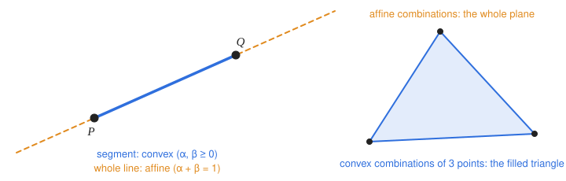
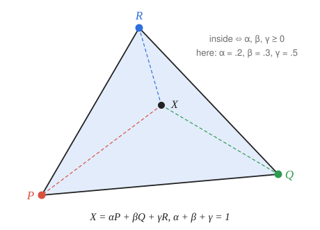

# 2 · Points, vectors and coordinate systems

**You will learn:** why graphics distinguishes points from vectors, how homogeneous coordinates encode that difference, the three kinds of combinations of points, barycentric coordinates, and what the dot and cross products tell you geometrically.

---

## 2.1 Points and vectors are different things

A **vector** has a direction and a length but no location: "3 meters north". A **point** has a location but no size: "the corner of this table". Graphics keeps them apart because they behave differently:

| Operation | Result | Meaning |
|---|---|---|
| vector + vector | vector | combine displacements |
| scalar × vector | vector | stretch a displacement |
| point − point | **vector** | the displacement from one to the other |
| point + vector | **point** | move a point |
| point + point | *undefined* | "Los Angeles + Paris" has no meaning |
| scalar × point | *undefined* | nor does "2 × Los Angeles" |

The structure these rules describe is an **affine space**: a set of points, plus a vector space of displacements between them.

Translation shows why the difference matters. Moving an object moves its **points**, but it must not change its **directions**: a surface normal still points the same way after the object slides sideways.

## 2.2 Coordinate systems and homogeneous coordinates

A **coordinate system**, or **frame**, is an origin $`O`$ plus basis vectors $`\mathbf{a}, \mathbf{b}, \mathbf{c}`$. Every vector is a combination of the basis vectors, and every point is the origin plus such a combination:

```math
\mathbf{v} = v_1 \mathbf{a} + v_2 \mathbf{b} + v_3 \mathbf{c},
\qquad
P = O + p_1 \mathbf{a} + p_2 \mathbf{b} + p_3 \mathbf{c}.
```

Both can be written with one matrix of basis vectors and origin, if we add a fourth coordinate:

```math
\mathbf{v} =
\begin{bmatrix} \mathbf{a} & \mathbf{b} & \mathbf{c} & O \end{bmatrix}
\begin{bmatrix} v_1 \\ v_2 \\ v_3 \\ 0 \end{bmatrix},
\qquad
P =
\begin{bmatrix} \mathbf{a} & \mathbf{b} & \mathbf{c} & O \end{bmatrix}
\begin{bmatrix} p_1 \\ p_2 \\ p_3 \\ 1 \end{bmatrix}.
```

This is the idea behind **homogeneous coordinates**: **vectors have $`w = 0`$ and points have $`w = 1`$.** The table in §2.1 then follows from ordinary arithmetic on the fourth coordinate:

- point − point: $`1 - 1 = 0`$, a vector.
- point + vector: $`1 + 0 = 1`$, a point.
- point + point: $`1 + 1 = 2`$, which is neither.

It also makes translation work automatically. A $`4 \times 4`$ translation matrix (chapter 4) adds its offset scaled by $`w`$, so it moves points and leaves vectors unchanged:

```math
\begin{bmatrix} 1&0&0&t_x \\ 0&1&0&t_y \\ 0&0&1&t_z \\ 0&0&0&1 \end{bmatrix}
\begin{bmatrix} x \\ y \\ z \\ w \end{bmatrix}
=
\begin{bmatrix} x + w\,t_x \\ y + w\,t_y \\ z + w\,t_z \\ w \end{bmatrix}.
```

Homogeneous coordinates have one more use. A perspective projection (chapter 6) produces $`w \ne 1`$, and the point it represents is $`(x/w,\ y/w,\ z/w)`$.

## 2.3 Linear, affine and convex combinations

Given points $`P_1, \dots, P_m`$ and scalars $`\alpha_1, \dots, \alpha_m`$:

| Name | Condition | Is $`\sum \alpha_i P_i`$ meaningful? |
|---|---|---|
| **linear** combination | none | only for vectors |
| **affine** combination | $`\sum \alpha_i = 1`$ | yes: always a point |
| **convex** combination | $`\sum \alpha_i = 1`$ and every $`\alpha_i \ge 0`$ | yes: a point *between* the $`P_i`$ |

Why does $`\sum \alpha_i = 1`$ make a sum of points legal? Rewrite the sum relative to $`P_1`$:

```math
\sum_i \alpha_i P_i = P_1 + \sum_{i \ge 2} \alpha_i (P_i - P_1) \quad \text{when } \textstyle\sum_i \alpha_i = 1,
```

which is a point plus vectors. The fourth coordinate agrees: $`\sum \alpha_i \cdot 1 = 1`$.



For two points, the affine combinations $`\alpha P + (1 - \alpha) Q`$ trace the entire **line** through $`P`$ and $`Q`$. The convex ones, with $`0 \le \alpha \le 1`$, give just the **segment** between them. For three points, the affine combinations fill the whole **plane**; the convex ones fill the **triangle**.

## 2.4 Parametric lines, planes and triangles

**Line** through $`P_0`$ with direction $`\mathbf{d}`$:

```math
P(t) = P_0 + t\,\mathbf{d}.
```

Choosing $`t \ge 0`$ gives a **ray**; $`t \in [0, 1]`$ with $`\mathbf{d} = P_1 - P_0`$ gives a **segment**.

**Plane** through $`P`$ spanned by vectors $`\mathbf{u}, \mathbf{v}`$:

```math
P(\alpha, \beta) = P + \alpha\,\mathbf{u} + \beta\,\mathbf{v}.
```

Its **normal** $`\mathbf{n} = \mathbf{u} \times \mathbf{v}`$ is perpendicular to both. That gives the implicit form: a point $`X`$ lies on the plane exactly when $`(X - P) \cdot \mathbf{n} = 0`$.

**Triangle** $`PQR`$: a point $`S(\alpha) = \alpha P + (1 - \alpha) Q`$ lies on edge $`PQ`$, and mixing it with $`R`$ gives

```math
T(\alpha, \beta) = \beta\, S(\alpha) + (1 - \beta) R, \qquad 0 \le \alpha, \beta \le 1,
```

which covers every point of the triangle.

## 2.5 Barycentric coordinates

Expanding $`T(\alpha, \beta)`$ shows that every point of the plane of $`PQR`$ can be written in exactly one way as

```math
X = \alpha P + \beta Q + \gamma R, \qquad \alpha + \beta + \gamma = 1.
```

The triple $`(\alpha, \beta, \gamma)`$ is the **barycentric coordinate** of $`X`$ with respect to the triangle.



| Where $`X`$ is | Barycentric coordinates |
|---|---|
| at a vertex | $`(1,0,0)`$, $`(0,1,0)`$ or $`(0,0,1)`$ |
| on an edge | one coordinate is 0 |
| at the centroid | $`(\tfrac13, \tfrac13, \tfrac13)`$ |
| inside | all three $`\gt 0`$ |
| outside | at least one $`\lt 0`$ |

Each weight is also a ratio of areas. $`\alpha`$ is the area of the sub-triangle $`XQR`$, opposite $`P`$, divided by the area of $`PQR`$; likewise for $`\beta`$ and $`\gamma`$. Barycentric coordinates are how a GPU **interpolates** per-vertex values (chapter 1), and how a ray tracer tests whether a hit is inside a triangle (chapter 11).

**Computing them.** With 2D coordinates or areas:

```math
\alpha = \frac{\operatorname{area}(X, Q, R)}{\operatorname{area}(P, Q, R)}, \quad
\beta = \frac{\operatorname{area}(P, X, R)}{\operatorname{area}(P, Q, R)}, \quad
\gamma = 1 - \alpha - \beta,
```

where a signed area comes from a cross product, $`\operatorname{area}(A, B, C) = \tfrac12\,((B - A) \times (C - A)) \cdot \hat{\mathbf{n}}`$.

## 2.6 What the dot and cross products mean

**Dot product.**

```math
\mathbf{u} \cdot \mathbf{v} = u_x v_x + u_y v_y + u_z v_z = \lVert\mathbf{u}\rVert\,\lVert\mathbf{v}\rVert \cos\theta
```

| Sign of $`\mathbf{u} \cdot \mathbf{v}`$ | Angle between them |
|---|---|
| positive | acute ($`\theta \lt 90°`$): roughly the same direction |
| zero | perpendicular |
| negative | obtuse: roughly opposite directions |

Uses: the angle between vectors; projecting $`\mathbf{v}`$ onto a unit vector $`\hat{\mathbf{u}}`$, whose length is $`\mathbf{v} \cdot \hat{\mathbf{u}}`$; testing which side of a plane a point is on; and the cosine factor in diffuse lighting (chapter 7).

**Cross product** (3D only).

```math
\mathbf{u} \times \mathbf{v} = (u_y v_z - u_z v_y,\ u_z v_x - u_x v_z,\ u_x v_y - u_y v_x)
```

Its direction is perpendicular to both inputs, following the right-hand rule. Its length is $`\lVert\mathbf{u}\rVert\,\lVert\mathbf{v}\rVert \sin\theta`$, the area of the parallelogram the two vectors span. Uses: surface normals, triangle area, building an orthonormal camera basis (chapter 6), and deciding whether a triangle winds clockwise or counter-clockwise (chapter 3).

---

## Check yourself

1. For unit vectors $`\mathbf{u}`$ and $`\mathbf{v}`$, what can you say about the angle between them if $`\mathbf{u} \cdot \mathbf{v}`$ is (a) $`0.3`$, (b) $`-1`$, (c) $`0`$? If the vectors are not unit length and $`\mathbf{u} \cdot \mathbf{v} = -1.5`$, what can you still say?
2. Is $`0.5P + 0.8Q - 0.3R`$ a point? Is it inside triangle $`PQR`$?
3. What are the barycentric coordinates of the midpoint of edge $`QR`$?
4. A triangle has vertices $`A = (0,0,0)`$, $`B = (2,0,0)`$, $`C = (0,3,0)`$. Find a unit normal and the triangle's area.
5. Why is the homogeneous coordinate of a vector 0 rather than 1?

<details><summary>Answers</summary>

1. (a) $`\cos\theta = 0.3`$, so $`\theta \approx 72.5°`$: acute. (b) $`\theta = 180°`$: exactly opposite. (c) $`\theta = 90°`$: perpendicular. With non-unit vectors, only the sign is informative: $`-1.5 \lt 0`$ means the angle is obtuse.
2. The weights sum to $`0.5 + 0.8 - 0.3 = 1`$, so it is an affine combination and therefore a point. One weight is negative, so it is not a convex combination and lies **outside** the triangle.
3. $`(0, \tfrac12, \tfrac12)`$.
4. $`(B - A) \times (C - A) = (2,0,0) \times (0,3,0) = (0, 0, 6)`$. The unit normal is $`(0,0,1)`$ and the area is $`\tfrac12 \cdot 6 = 3`$.
5. So that a translation matrix, which adds its offset times $`w`$, leaves vectors unchanged, and so that differences of points ($`1 - 1`$) come out as vectors automatically.

</details>

## Further reading

- Peter Shirley and Steve Marschner, *Fundamentals of Computer Graphics*, chapter 2 (vectors) and 2.9 (barycentric coordinates).
- [Scratchapixel: Geometry](https://www.scratchapixel.com/lessons/mathematics-physics-for-computer-graphics/geometry/).
