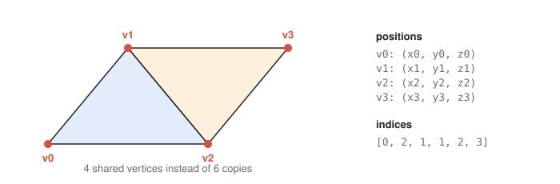
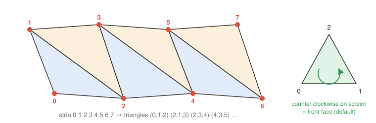
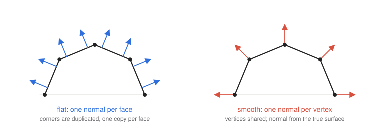

# 3 · Modeling shapes with triangles

**You will learn:** how curved shapes are approximated by triangles, how meshes are stored (vertex arrays, index lists, triangle strips), what winding order decides, and why the same corner sometimes needs several copies with different normals.

**Try it:** [TinyGraphics `Surfaces_Demo`](https://github.com/intro-graphics/TinyGraphics.js/blob/v2/examples/surfaces-demo.js) · [demo 04](../demos/04-lighting-and-shading.html) (flat vs. smooth normals)

---

## 3.1 Discretization

GPUs rasterize only points, line segments and triangles. A sphere, a teapot or a terrain must therefore be **discretized**: sample the surface at finitely many points, then connect neighbouring samples with flat triangles. More samples give a better approximation, at the cost of more vertices to transform.

A circle of radius $`r`$ sampled at $`N`$ angles is a regular $`N`$-gon:

```math
P_k = \left(r\cos\tfrac{2\pi k}{N},\ r\sin\tfrac{2\pi k}{N}\right), \qquad k = 0, \dots, N-1.
```

Its largest gap from the true circle is $`r\,(1 - \cos\tfrac{\pi}{N})`$, which shrinks as $`1/N^2`$. Doubling the sample count cuts the error by about four. That is why a sphere with a few hundred triangles already looks round, except along its **silhouette**, where the polygon edges show.

Surfaces are discretized the same way, with two parameters. A **parametric surface** $`S(s, t)`$ sampled on a grid of $`(s_i, t_j)`$ gives rows and columns of points, and each grid cell splits into two triangles. A **surface of revolution** sweeps a 2D profile curve around an axis: $`s`$ picks a point on the profile, $`t`$ picks the rotation angle. Cylinders, cones, tori, vases and bullets are all built this way.

## 3.2 Storing a mesh

**Vertex arrays.** Every vertex carries attributes, and each attribute gets its own array, all indexed the same way:

```
position[i]       where vertex i is
normal[i]         which way the surface faces there (chapter 7)
texture_coord[i]  where it samples an image (chapter 8)
```

**Triangle list.** Every three consecutive vertices form a triangle. This is simple, but a vertex shared by six triangles is stored six times.

**Indexed mesh.** Store each distinct vertex once, plus a list of **indices**: every three indices name one triangle.



For a closed mesh the savings are large. A typical vertex is shared by about six triangles, so an indexed mesh needs about one sixth as many vertices as a plain triangle list.

**Triangle strip.** After the first two vertices, each new vertex forms a triangle with the previous two, so $`N`$ triangles need only $`N + 2`$ vertices.



The GPU flips the order of every other triangle, $`(i, i{+}1, i{+}2)`$ for even $`i`$ and $`(i{+}1, i, i{+}2)`$ for odd $`i`$, so that all triangles in the strip keep the same winding. A strip is exactly what a grid row needs. Draw one with `gl.drawArrays(gl.TRIANGLE_STRIP, 0, count)`.

## 3.3 Winding order and back faces

The order in which a triangle lists its vertices defines a direction. By convention, a triangle whose vertices appear **counter-clockwise on screen** is **front-facing**. For a closed mesh whose triangles all wind counter-clockwise when viewed from outside, the back faces are exactly the triangles facing away from the camera. `gl.enable(gl.CULL_FACE)` skips drawing them, which roughly halves the work for closed objects.

The 3D equivalent: the face normal $`(B - A) \times (C - A)`$ of triangle $`ABC`$ points toward whoever sees $`A \to B \to C`$ as counter-clockwise.

## 3.4 One corner, several normals: flat versus smooth

Lighting (chapter 7) needs a **normal** at every vertex. A mesh can use normals in two ways:



**Smooth.** Each vertex gets the normal of the *true* surface it samples. For a sphere, that is the position itself, normalized. Neighbouring triangles share the vertex and its normal, lighting varies continuously across edges, and the faceting disappears everywhere except the silhouette.

**Flat.** Each triangle gets its own face normal, identical at its three corners, so the lighting is constant across each face. This is right for things that really are faceted, like a cube, a gem or a low-poly art style. But a vertex can hold only one normal. If a corner belongs to three faces of a cube, and each face needs a different normal, the corner must be **stored three times**, at the same position with three different normals. That is why a cube has 24 vertices, not 8.

The same applies to any attribute that jumps across an edge. A texture seam, where the $`u`$ coordinate wraps from 1 back to 0, also needs duplicated vertices.

TinyGraphics shapes can switch to flat shading after construction. `make_flat_shaded_version()` un-shares every vertex and assigns face normals:

```js
this.shapes.gem = new (defs.Subdivision_Sphere.prototype.make_flat_shaded_version())(2);
```

## 3.5 Building a shape in code

A shape is its arrays plus its indices. The smallest useful example is a square made of two triangles that share an edge:

```js
class Square extends Shape {
    constructor() {
        super("position", "normal", "texture_coord");
        this.arrays.position      = Vector3.cast([-1, -1, 0], [1, -1, 0], [-1, 1, 0], [1, 1, 0]);
        this.arrays.normal        = Vector3.cast([0, 0, 1], [0, 0, 1], [0, 0, 1], [0, 0, 1]);
        this.arrays.texture_coord = Vector.cast([0, 0], [1, 0], [0, 1], [1, 1]);
        this.indices = [0, 1, 2,   1, 3, 2];        // both counter-clockwise, seen from +z
    }
}
```

**Compound shapes** are built by transforming copies of simpler shapes into one array. A cube is six squares, each rotated to its side and pushed out by one unit. The benefit is a single draw call instead of six, which is much faster when the shape is drawn thousands of times.

**Subdivision surfaces** refine a coarse mesh. `Subdivision_Sphere` starts from a tetrahedron, splits each triangle into four at its edge midpoints, and pushes every new vertex out onto the unit sphere. Each level multiplies the triangle count by 4: 4, 16, 64, 256, …

---

## Check yourself

1. How many vertices does a triangle strip need for 10 triangles? How many would a plain triangle list need?
2. A UV sphere has 32 slices and 16 stacks. Roughly how many triangles does it have, and why do the two poles differ from the rest?
3. Why does a flat-shaded cube need 24 vertices while a smooth-shaded sphere can share every vertex?
4. The triangle $`A = (0,0,0)`$, $`B = (0,1,0)`$, $`C = (1,0,0)`$ is viewed from $`+z`$, looking down the $`-z`$ axis. Is it front-facing?
5. A circle is approximated with $`N = 16`$ segments. What is the maximum gap from the true circle, as a fraction of the radius? What $`N`$ is needed to bring it under 0.1%?

<details><summary>Answers</summary>

1. $`10 + 2 = 12`$ for a strip; $`3 \times 10 = 30`$ for a list.
2. The body has $`32 \times (16 - 2) \times 2 = 896`$ triangles, and each of the two end rows has 32, for $`960`$ in all. At a pole every column meets at one point, so each cell there degenerates into a single triangle instead of two.
3. At a cube corner, three faces meet with three different normals, and a vertex stores only one normal. So each corner is stored once per face: $`8 \times 3 = 24`$. A sphere's true normal is continuous, so neighbouring triangles want the same normal at a shared vertex.
4. $`(B - A) \times (C - A) = (0,1,0) \times (1,0,0) = (0, 0, -1)`$. The normal points away from the viewer at $`+z`$, so the vertices appear clockwise and the triangle is **back-facing**.
5. $`1 - \cos(\pi/16) \approx 0.0192`$, about 1.9%. We need $`1 - \cos(\pi/N) \lt 0.001`$, so $`\pi/N \lt \arccos(0.999) \approx 0.0447`$, which gives $`N \ge 71`$.

</details>

## Further reading

- [TinyGraphics.js `common.js`](https://github.com/intro-graphics/TinyGraphics.js/blob/v2/common.js): read `Square`, `Cube`, `Subdivision_Sphere`, `Grid_Patch` and `Surface_Of_Revolution` in that order.
- Mario Botsch et al., *Polygon Mesh Processing*, chapter 2 (mesh data structures).
