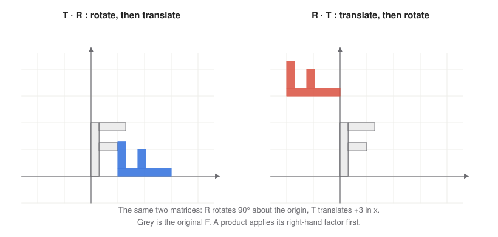

# 4 · Transformations

**You will learn:** the matrices for translation, scaling, rotation, shear and reflection; how to invert them; why their order matters; and how to build hierarchical, animated models by multiplying matrices together.

**Demo:** [02 · Transformations and their order](https://luckiday.github.io/graphics-foundations/demos/02-transformations.html) · [source](../demos/02-transformations.html)

---

## 4.1 Why matrices

Every transformation in this chapter is **affine**: it maps lines to lines and preserves ratios along a line. In homogeneous coordinates (chapter 2) every affine transformation of 3D space is a $`4 \times 4`$ matrix with bottom row $`(0, 0, 0, 1)`$:

```math
\begin{bmatrix} x' \\ y' \\ z' \\ 1 \end{bmatrix}
=
\begin{bmatrix}
a & b & c & t_x \\
d & e & f & t_y \\
g & h & i & t_z \\
0 & 0 & 0 & 1
\end{bmatrix}
\begin{bmatrix} x \\ y \\ z \\ 1 \end{bmatrix}.
```

The upper-left $`3 \times 3`$ block holds the linear part: rotation, scale, shear, reflection. The last column holds the translation. Because every transformation is a matrix, any **sequence** of them collapses into a single matrix product. A vertex shader multiplies each vertex by that one matrix, no matter how many steps built it.

## 4.2 The basic transformations

**Translation** by $`(t_x, t_y, t_z)`$:

```math
T = \begin{bmatrix} 1&0&0&t_x \\ 0&1&0&t_y \\ 0&0&1&t_z \\ 0&0&0&1 \end{bmatrix},
\qquad T^{-1} = T(-t_x, -t_y, -t_z).
```

**Scaling** by $`(s_x, s_y, s_z)`$ about the origin:

```math
S = \begin{bmatrix} s_x&0&0&0 \\ 0&s_y&0&0 \\ 0&0&s_z&0 \\ 0&0&0&1 \end{bmatrix},
\qquad S^{-1} = S(1/s_x, 1/s_y, 1/s_z).
```

With $`s_x = s_y = s_z`$ the scale is **uniform** and preserves angles. An odd number of negative factors mirrors the shape (its determinant is negative). Two negative factors are just a $`180°`$ rotation.

**Rotation** by angle $`\theta`$ about a coordinate axis, counter-clockwise when looking from the positive axis toward the origin (the right-hand rule):

```math
R_x = \begin{bmatrix} 1&0&0&0 \\ 0&\cos\, \theta&-\sin\, \theta&0 \\ 0&\sin\, \theta&\cos\, \theta&0 \\ 0&0&0&1 \end{bmatrix},\quad
R_y = \begin{bmatrix} \cos\, \theta&0&\sin\, \theta&0 \\ 0&1&0&0 \\ -\sin\, \theta&0&\cos\, \theta&0 \\ 0&0&0&1 \end{bmatrix},\quad
R_z = \begin{bmatrix} \cos\, \theta&-\sin\, \theta&0&0 \\ \sin\, \theta&\cos\, \theta&0&0 \\ 0&0&1&0 \\ 0&0&0&1 \end{bmatrix}.
```

To remember them: rotating about an axis leaves that axis's row and column as the identity. The minus sign sits so that $`R_z`$ takes $`\hat{x}`$ to $`\hat{y}`$, $`R_x`$ takes $`\hat{y}`$ to $`\hat{z}`$, and $`R_y`$ takes $`\hat{z}`$ to $`\hat{x}`$. This is why $`R_y`$ looks "flipped" compared to the other two. For example, with $`\theta = 45°`$:

```math
R_z(45°) = \begin{bmatrix} \tfrac{1}{\sqrt2}&-\tfrac{1}{\sqrt2}&0&0 \\ \tfrac{1}{\sqrt2}&\tfrac{1}{\sqrt2}&0&0 \\ 0&0&1&0 \\ 0&0&0&1 \end{bmatrix}.
```

A rotation matrix's $`3 \times 3`$ block is **orthonormal**: its columns are perpendicular unit vectors. So its inverse is its transpose, $`R^{-1} = R^{𝖳} = R(-\theta)`$.

**Rotation about any axis** through the origin, with unit direction $`\hat{𝐚} = (a_x, a_y, a_z)`$, is given by Rodrigues' formula:

```math
R = \cos\, \theta\, I + \sin\, \theta\, [\hat{𝐚}]_\times + (1 - \cos\, \theta)\, \hat{𝐚}\hat{𝐚}^{𝖳},
\qquad
[\hat{𝐚}]_\times = \begin{bmatrix} 0&-a_z&a_y \\ a_z&0&-a_x \\ -a_y&a_x&0 \end{bmatrix}.
```

`Mat4.rotation(angle, x, y, z)` implements this formula. The angle is in **radians**, and the axis need not be unit length, because the function normalizes it.

**Shear.** Each coordinate gains multiples of the others:

```math
x' = x + h_{xy}\,y + h_{xz}\,z,\quad y' = h_{yx}\,x + y + h_{yz}\,z,\quad z' = h_{zx}\,x + h_{zy}\,y + z,
\qquad
H = \begin{bmatrix} 1&h_{xy}&h_{xz}&0 \\ h_{yx}&1&h_{yz}&0 \\ h_{zx}&h_{zy}&1&0 \\ 0&0&0&1 \end{bmatrix}.
```

A single shear $`h_{xy}`$ slides each horizontal slice sideways in proportion to its height, the way a deck of cards leans. Its inverse is the shear by $`-h_{xy}`$. You rarely build shears on purpose, but they appear whenever a non-uniform scale is followed by a rotation of the scaled frame (§4.5).

**Reflection** across a plane through the origin with unit normal $`\hat{𝐧}`$:

```math
F = I - 2\,\hat{𝐧}\hat{𝐧}^{𝖳}
= \begin{bmatrix} 1-2n_x^2 & -2n_xn_y & -2n_xn_z \\ -2n_xn_y & 1-2n_y^2 & -2n_yn_z \\ -2n_xn_z & -2n_yn_z & 1-2n_z^2 \end{bmatrix}.
```

The formula follows from removing twice the component of $`𝐩`$ along $`\hat{𝐧}`$: $`𝐩' = 𝐩 - 2(𝐩\cdot\hat{𝐧})\hat{𝐧}`$. A reflection is its own inverse. Its determinant is $`-1`$, so it flips winding order (chapter 3): a mirrored mesh's front faces become back faces.

## 4.3 Order matters

Matrix multiplication is **not commutative**, and neither are transformations.



In $`M = T\,R`$ applied to a point $`𝐩`$, the matrix nearest $`𝐩`$ acts first: $`M𝐩 = T(R\,𝐩)`$. In TinyGraphics, `T.times(R)` is the product $`T\,R`$, so the rotation acts on the point first. So $`TR`$ rotates and then translates, while $`RT`$ translates and then rotates about the origin, swinging the object around it. The same holds for scaling: $`TS`$ scales in place and then moves, while $`ST`$ also scales the translation distance.

There are two equally valid ways to read a product such as $`M = T\,R\,S`$:

- **Right to left, fixed axes.** The object is scaled, then rotated, then translated, always with respect to the world's axes.
- **Left to right, moving frame.** Start with the world frame. $`T`$ moves the frame; $`R`$ rotates the *moved* frame about its own origin; $`S`$ scales along the *rotated* axes; then draw the object in that final frame.

The second reading is how code builds models step by step:

```js
let model = Mat4.identity();
model = model.times(Mat4.translation(0, 2, 0));    // move up
model = model.times(Mat4.rotation(t, 0, 1, 0));    // spin about the moved frame's own y axis
model = model.times(Mat4.scale(1, 3, 1));          // stretch along the spun frame's y axis
shape.draw(context, program_state, model, material);
```

**Rotating or scaling about a point** $`𝐜`$ other than the origin: move $`𝐜`$ to the origin, transform, then move it back.

```math
R_{𝐜} = T(𝐜)\; R\; T(-𝐜).
```

**Inverse of a product:** $`(ABC)^{-1} = C^{-1} B^{-1} A^{-1}`$. You undo the steps in reverse order, like taking off shoes and then socks.

## 4.4 Worked example: where does the F go?

A 2D letter F has its local origin at the bottom of its stem. Its stem points along local $`+y`$ and its arms along local $`+x`$. The code runs

```js
let model = Mat4.identity();
model = model.times(Mat4.translation(2, 1, 0));
model = model.times(Mat4.rotation(Math.PI / 2, 0, 0, 1));
model = model.times(Mat4.scale(-1, 1, 1));
```

Where does the F end up, and which way do its stem and arms point?

**Frame reading.** Move the frame to $`(2, 1)`$. Rotate it $`90°`$ counter-clockwise, so its $`x`$ axis points world $`+y`$ and its $`y`$ axis points world $`-x`$. Then flip its $`x`$ axis, so it now points world $`-y`$. The F's origin is at $`(2, 1)`$, its stem (local $`+y`$) points **left**, and its arms (local $`+x`$, flipped) point **down**.

**Fixed-axes reading.** Apply the steps right to left, always about the world's origin and axes. $`S(-1, 1)`$ flips the F across the $`y`$ axis, so its arms point left. $`R_z(90°)`$ swings it counter-clockwise about the origin: the stem now points left and the arms point down. $`T`$ then carries the base of the stem from the origin to $`(2, 1)`$. Same result, with the steps read in the opposite order.

**Matrix check.** With $`R = R_z(90°)`$ and $`S = S(-1, 1)`$, the linear part is

```math
R\,S = \begin{bmatrix} 0&-1 \\ 1&0 \end{bmatrix}\begin{bmatrix} -1&0 \\ 0&1 \end{bmatrix} = \begin{bmatrix} 0&-1 \\ -1&0 \end{bmatrix},
\qquad
M = \begin{bmatrix} 0&-1&0&2 \\ -1&0&0&1 \\ 0&0&1&0 \\ 0&0&0&1 \end{bmatrix}.
```

The stem tip at local $`(0, 2)`$ maps to $`(0\cdot0 - 1\cdot2 + 2,\; -1\cdot0 + 0\cdot2 + 1) = (0, 1)`$: two units left of the origin. An arm tip at local $`(1, 2)`$ maps to $`(0, 0)`$, one unit below the stem tip. All three agree. Note that $`\det M = -1`$: the F is mirrored, so its triangles' winding flips, and back-face culling (chapter 3) would now hide its front.

Try other orders in [demo 02](https://luckiday.github.io/graphics-foundations/demos/02-transformations.html), which draws every intermediate frame.

## 4.5 Hierarchical modeling

Articulated objects, like a robot arm, a planet with moons or a walking character, are **trees**. Each part's transformation is relative to its parent. Walking down the tree multiplies the matrices together:

```math
M_{\text{hand}} = M_{\text{body}}\; M_{\text{shoulder}}\; M_{\text{elbow}}\; M_{\text{wrist}}.
```

Rotating the shoulder then moves the elbow, wrist and hand with it, without any extra code.

```js
const body = Mat4.translation(x, 0, 0);
draw(torso, body.times(Mat4.scale(1, 2, .5)));             // scale only this draw: don't keep it

let arm = body.times(Mat4.translation(1, 1.5, 0))          // shoulder joint position
              .times(Mat4.rotation(shoulder_angle, 0, 0, 1))
              .times(Mat4.translation(1, 0, 0));           // move to the upper arm's center
draw(upper_arm, arm.times(Mat4.scale(1, .2, .2)));

arm = arm.times(Mat4.translation(1, 0, 0))                 // elbow joint at the end of the upper arm
         .times(Mat4.rotation(elbow_angle, 0, 0, 1))
         .times(Mat4.translation(1, 0, 0));
draw(forearm, arm.times(Mat4.scale(1, .2, .2)));
```

Two habits keep hierarchies correct:

1. **Scale each part inside its own draw call.** Never keep the scale in the matrix you pass to children. A non-uniform scale left in the chain turns every later rotation into a shear.
2. **Rotate about the joint.** Translate to the joint, rotate, then translate out to the part's center. This is the $`T(𝐜)\,R\,T(-𝐜)`$ pattern again.

When a tree branches, save the parent matrix before descending into one branch and restore it before the next. With immutable `.times()` this is automatic: keep the parent in its own variable. Older APIs used an explicit **matrix stack**, `push()` and `pop()`, for the same purpose.

## 4.6 Animation

Make a transformation depend on time, and the scene moves:

```js
const t = program_state.animation_time / 1000;                   // seconds
const orbit = Mat4.rotation(t * 2 * Math.PI / 10, 0, 1, 0)       // one orbit every 10 s
                  .times(Mat4.translation(5, 0, 0))
                  .times(Mat4.rotation(t * 2 * Math.PI, 0, 1, 0));   // spins once per second
```

There are two styles:

- **Pure function of time**, as above. Every frame recomputes the matrix from $`t`$. It is exact, frame-rate independent, and it makes seeking or pausing trivial.
- **Incremental.** Store a matrix and multiply a small step onto it each frame, scaled by the frame time $`\Delta t`$: `this.m.post_multiply(Mat4.rotation(omega * dt, 0, 1, 0))`. This is necessary when motion depends on state such as velocities or collisions (chapter 9). Floating-point error accumulates over thousands of steps, so re-orthonormalize rotations occasionally or store position and angle separately.

---

## Check yourself

1. Write the $`4 \times 4`$ matrix that rotates $`90°`$ about the $`y`$ axis. Where does it send the point $`(1, 0, 0)`$?
2. A unit square is transformed by `translation(3, 0, 0).times(scale(2, 2, 1))`. Where does its corner $`(1, 1)`$ end up? What if the factors are swapped?
3. Give a single matrix that rotates by $`\theta`$ about the point $`(4, 5, 0)`$, in the $`xy`$ plane.
4. Reflect the point $`(1, 2, 3)`$ across the plane $`x + y = 0`$.
5. Explain why applying `scale(1, 3, 1)` to a parent matrix and then rotating a child about $`z`$ makes the child look sheared.
6. Is $`(TR)^{-1} = T^{-1}R^{-1}`$? If not, what is it?

<details><summary>Answers</summary>

1. $`R_y(90°)`$ sends $`(1,0,0)`$ to $`(0, 0, -1)`$. Check with the right-hand rule: $`\hat{z} \to \hat{x}`$, so $`\hat{x} \to -\hat{z}`$.

   ```math
   R_y(90°) = \begin{bmatrix} 0&0&1&0 \\ 0&1&0&0 \\ -1&0&0&0 \\ 0&0&0&1 \end{bmatrix}
   ```

2. $`T\,S`$: scale to $`(2, 2)`$, then translate to $`(5, 2)`$. $`S\,T`$: translate to $`(4, 1)`$, then scale to $`(8, 2)`$.
3. $`T(4,5,0)\; R_z(\theta)\; T(-4,-5,0)`$.
4. $`\hat{𝐧} = (1, 1, 0)/\sqrt2`$ and $`𝐩\cdot\hat{𝐧} = 3/\sqrt2`$, so $`𝐩' = 𝐩 - 2\cdot\tfrac{3}{\sqrt2}\cdot\tfrac{(1,1,0)}{\sqrt2} = (1,2,3) - (3,3,0) = (-2, -1, 3)`$.
5. The child's matrix is $`S\,R`$. Its linear part $`S\,R_z`$ first rotates the child's axes, then triples each one's component along the *parent's* $`y`$ axis. The rotated axes $`(\cos\, \theta, \sin\, \theta)`$ and $`(-\sin\, \theta, \cos\, \theta)`$ become $`(\cos\, \theta, 3\sin\, \theta)`$ and $`(-\sin\, \theta, 3\cos\, \theta)`$, whose dot product is $`8\sin\, \theta\cos\, \theta`$. That is nonzero unless $`\theta`$ is a multiple of $`90°`$. A non-orthogonal pair of axes is a shear.
6. No. $`(TR)^{-1} = R^{-1}T^{-1}`$: undo the last step first.

</details>

## Further reading

- Shirley and Marschner, *Fundamentals of Computer Graphics*, chapter 7 (transformation matrices).
- [3Blue1Brown, *Essence of Linear Algebra*](https://www.3blue1brown.com/topics/linear-algebra), chapters 3–4: matrices as transformations, and composition.
