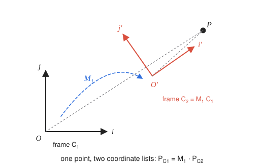

# 5 · Change of basis

**You will learn:** that a transformation matrix can be read either as moving points or as describing a new coordinate frame; how to convert a point's coordinates between two frames; and how this produces the camera's view matrix.

---

## 5.1 One point, two descriptions

Chapter 4 read matrices as operations that **move points**. There is a second, equally useful reading: a matrix **describes a coordinate frame**. The same physical point then has different coordinates depending on which frame you measure it in.



Let frame $`C_1`$ have origin $`O`$ and orthonormal axes $`𝐢, 𝐣, 𝐤`$. Apply a transformation $`M_1`$, written in $`C_1`$'s own coordinates, to the whole frame, and you get a new frame $`C_2`$ with origin $`O'`$ and axes $`𝐢', 𝐣', 𝐤'`$:

```math
\begin{bmatrix} 𝐢' & 𝐣' & 𝐤' & O' \end{bmatrix}
= M_1 \begin{bmatrix} 𝐢 & 𝐣 & 𝐤 & O \end{bmatrix}. \qquad (1)
```

**Question.** A point $`P`$ has coordinates $`𝐩_{C_2} = (x', y', z', 1)^{𝖳}`$ in frame $`C_2`$. What are its coordinates $`𝐩_{C_1} = (x, y, z, 1)^{𝖳}`$ in $`C_1`$?

**Answer.** Write the one point $`P`$ in both frames (chapter 2) and set the expressions equal:

```math
P = \begin{bmatrix} 𝐢 & 𝐣 & 𝐤 & O \end{bmatrix} 𝐩_{C_1}
  = \begin{bmatrix} 𝐢' & 𝐣' & 𝐤' & O' \end{bmatrix} 𝐩_{C_2}
  = M_1 \begin{bmatrix} 𝐢 & 𝐣 & 𝐤 & O \end{bmatrix} 𝐩_{C_2}.
```

Measured in $`C_1`$ itself, the frame matrix $`[𝐢\ 𝐣\ 𝐤\ O]`$ is the identity. So

```math
𝐩_{C_1} = M_1\, 𝐩_{C_2}, \qquad 𝐩_{C_2} = M_1^{-1}\, 𝐩_{C_1}.
```

The matrix that **moves frame $`C_1`$ onto frame $`C_2`$** converts coordinates the *other* way, from $`C_2`$ back to $`C_1`$. This single fact is behind the view matrix, hierarchical models and cameras attached to moving objects.

## 5.2 What the matrix looks like

Use equation (1) with the old frame matrix equal to the identity. The columns of $`M_1`$ are then the new frame's axes and origin, written in old coordinates:

```math
M_1 = \begin{bmatrix} 𝐢' & 𝐣' & 𝐤' & O' \end{bmatrix}
= \begin{bmatrix}
i'_x & j'_x & k'_x & O'_x \\
i'_y & j'_y & k'_y & O'_y \\
i'_z & j'_z & k'_z & O'_z \\
0 & 0 & 0 & 1
\end{bmatrix}.
```

**To build a frame matrix, write its axes and its origin as columns.**

When the new axes are orthonormal and right-handed ($`𝐤' = 𝐢' \times 𝐣'`$), $`M_1`$ splits into a rotation followed by a translation, $`M_1 = T R`$:

```math
R = \begin{bmatrix} i'_x & j'_x & k'_x & 0 \\ i'_y & j'_y & k'_y & 0 \\ i'_z & j'_z & k'_z & 0 \\ 0&0&0&1 \end{bmatrix},
\qquad
T = \begin{bmatrix} 1&0&0&O'_x \\ 0&1&0&O'_y \\ 0&0&1&O'_z \\ 0&0&0&1 \end{bmatrix}.
```

Its inverse is cheap, because a rotation's inverse is its transpose:

```math
M_1^{-1} = R^{-1} T^{-1} = R^{𝖳}\, T(-O')
= \begin{bmatrix}
i'_x & i'_y & i'_z & -𝐢' \cdot O' \\
j'_x & j'_y & j'_z & -𝐣' \cdot O' \\
k'_x & k'_y & k'_z & -𝐤' \cdot O' \\
0&0&0&1
\end{bmatrix}.
```

Reading $`M_1^{-1}`$ row by row: the new coordinate $`x'`$ is the dot product of $`𝐢'`$ with $`(P - O')`$. You are measuring how far $`P`$ lies along each new axis, starting from the new origin.

## 5.3 Successive frames

Now transform $`C_2`$ by $`M_2`$ to get $`C_3`$, where $`M_2`$ is expressed **in $`C_2`$'s coordinates**. Applying §5.1 twice gives

```math
𝐩_{C_2} = M_2\, 𝐩_{C_3},
\qquad
𝐩_{C_1} = M_1\, 𝐩_{C_2} = M_1 M_2\, 𝐩_{C_3}.
```

Composing frame changes, each described relative to the previous frame, multiplies matrices **on the right**. This is exactly the "left to right, moving frame" reading of chapter 4, and exactly what `model = model.times(next)` does. A hierarchical model is a chain of frames, and drawing a part converts its coordinates all the way back to the world.

If $`M_2`$ is instead written in $`C_1`$'s (world) coordinates, it acts on the whole frame $`M_1`$ from the left: $`𝐩_{C_1} = M_2 M_1\, 𝐩_{C_3}`$. That is chapter 4's "right to left, fixed axes" reading. The same product can be read either way; what differs is the frame each factor is written in.

## 5.4 The camera is just another frame

A camera is a frame too. Its origin is the eye point, and it looks down its own $`-𝐤'`$ axis with $`𝐣'`$ pointing up. Put the camera's axes and eye position into $`M_{\text{cam}}`$ as columns, as in §5.2. Then

```math
𝐩_{\text{camera}} = M_{\text{cam}}^{-1}\, 𝐩_{\text{world}}.
```

$`M_{\text{cam}}^{-1}`$ is the **view matrix**. It is what `program_state.set_camera()` expects and what `Mat4.look_at()` returns.

A common mistake is to pass $`M_{\text{cam}}`$ itself to `set_camera()`. The scene then moves opposite to the way the camera should. If you have built the camera's frame matrix, for example to attach the camera to a moving object, pass it to `program_state.set_camera_transform()`, which inverts it for you.

**Building the camera frame from an eye point, a target and an up hint:**

```math
𝐤' = \frac{P_{\text{eye}} - P_{\text{ref}}}{\lVert P_{\text{eye}} - P_{\text{ref}} \rVert},
\qquad
𝐢' = \frac{𝐯_{\text{up}} \times 𝐤'}{\lVert 𝐯_{\text{up}} \times 𝐤' \rVert},
\qquad
𝐣' = 𝐤' \times 𝐢',
\qquad
O' = P_{\text{eye}}.
```

Here $`𝐤'`$ points *backward*, from the target toward the eye, so that the camera looks along $`-𝐤'`$. The up hint need not be perpendicular to the view direction. The cross products straighten it out, which is why $`𝐣'`$ is recomputed rather than taken from $`𝐯_{\text{up}}`$. Chapter 6 continues from here.

## 5.5 Worked example

A camera starts at the origin looking down $`-z`$, with the point $`P = (0, 0, -1)`$ straight ahead. The camera then moves to $`(10, 0, 0)`$ and turns to face the origin, keeping $`+y`$ up.

**(a) Find the camera's frame matrix $`M`$.**

- Backward axis: $`𝐤' = \dfrac{(10,0,0) - (0,0,0)}{10} = (1, 0, 0)`$.
- Right axis: $`𝐢' = (0,1,0) \times (1,0,0) = (0, 0, -1)`$.
- Up axis: $`𝐣' = 𝐤' \times 𝐢' = (1,0,0) \times (0,0,-1) = (0, 1, 0)`$.
- Origin: $`O' = (10, 0, 0)`$.

```math
M = \begin{bmatrix} 0&0&1&10 \\ 0&1&0&0 \\ -1&0&0&0 \\ 0&0&0&1 \end{bmatrix}.
```

As a check, the upper-left block is $`R_y(90°)`$: turning $`90°`$ about $`y`$ swings a camera that looked down $`-z`$ to look down $`-x`$.

**(b) Find $`P`$'s coordinates in the moved camera's frame.**

```math
𝐩_{\text{cam}} = M^{-1}𝐩_{\text{world}}:\qquad
P - O' = (-10, 0, -1),\quad
x' = 𝐢'\cdot(P - O') = 1,\quad
y' = 𝐣'\cdot(P - O') = 0,\quad
z' = 𝐤'\cdot(P - O') = -10.
```

So $`𝐩_{\text{cam}} = (1, 0, -10)`$. $`P`$ is 10 units in front of the camera ($`z' = -10`$) and 1 unit to its right. That matches the picture: standing at $`x = 10`$ facing the origin, $`P`$ at $`z = -1`$ is off to the right.

---

## Check yourself

1. A frame has origin $`(1, 2, 3)`$ and axes equal to the world axes. A point has coordinates $`(0, 0, 0)`$ in that frame. What are its world coordinates? What matrix converts world coordinates into the frame's?
2. Why is $`M^{-1}`$ of a rigid frame (rotation plus translation) easy to compute, while $`M^{-1}`$ of a general $`4 \times 4`$ matrix is not?
3. A camera sits at $`(0, 5, 0)`$ looking at the origin with up hint $`(0, 0, -1)`$. Compute $`𝐢'`$, $`𝐣'`$, $`𝐤'`$.
4. What goes wrong if you pass look-at the up hint $`(0, 1, 0)`$ for the camera in question 3?
5. `model = Mat4.translation(2, 0, 0).times(Mat4.rotation(Math.PI / 2, 0, 0, 1))`. A point has coordinates $`(1, 0, 0)`$ in the model's frame. What are its world coordinates? What are the model-frame coordinates of the world point $`(2, 3, 0)`$?

<details><summary>Answers</summary>

1. World $`(1, 2, 3)`$. World to frame is $`T(-1, -2, -3)`$.
2. A rigid frame's inverse is $`R^{𝖳}`$ combined with a translation by the rotated, negated origin. It needs no division, and no determinant or cofactors. A general matrix needs Gaussian elimination or cofactors, and may not be invertible at all.
3. $`𝐤' = (0, 1, 0)`$. $`𝐢' = (0,0,-1) \times (0,1,0) = (1, 0, 0)`$. $`𝐣' = (0,1,0) \times (1,0,0) = (0, 0, -1)`$. The camera looks straight down, with world $`-z`$ at the top of the image.
4. The up hint is parallel to $`𝐤'`$, so $`𝐯_{\text{up}} \times 𝐤' = 𝟎`$. Normalizing a zero vector divides by zero, and the frame is undefined. `Mat4.look_at` throws an error in this case.
5. The frame's axes and origin are the columns of `model`: $`𝐢' = (0, 1, 0)`$, $`𝐣' = (-1, 0, 0)`$, $`O' = (2, 0, 0)`$. World: $`O' + 1\cdot𝐢' = (2, 1, 0)`$. Back: $`P - O' = (0, 3, 0)`$, so $`x' = 𝐢'\cdot(P - O') = 3`$ and $`y' = 𝐣'\cdot(P - O') = 0`$, giving $`(3, 0, 0)`$.

</details>

## Further reading

- Shirley and Marschner, *Fundamentals of Computer Graphics*, §7.5 (coordinate transformations).
- [3Blue1Brown, *Change of basis*](https://www.3blue1brown.com/lessons/change-of-basis).
