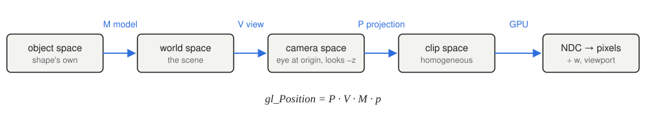
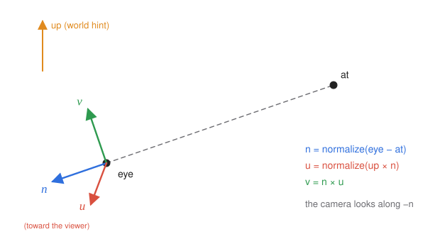
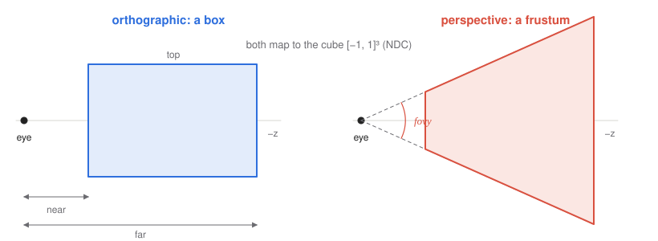
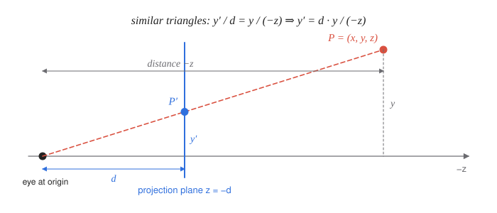

# 6 · Viewing and projection

**You will learn:** how the view matrix places the camera; how orthographic and perspective projection matrices are derived; what the perspective divide, clipping and the viewport do; why depth precision is uneven; and how the z-buffer hides surfaces behind other surfaces.

**Demo:** [03 · Camera and projection](https://luckiday.github.io/graphics-foundations/demos/03-camera-and-projection.html) · [source](../demos/03-camera-and-projection.html)

---

## 6.1 The viewing pipeline



```math
𝐩_{\text{clip}} = \underbrace{P}_{\text{projection}}\; \underbrace{V}_{\text{view}}\; \underbrace{M}_{\text{model}}\; 𝐩_{\text{object}}
```

| Step | Question it answers |
|---|---|
| model $`M`$ | where is this object in the world? (chapter 4) |
| view $`V`$ | where is the world relative to the camera? |
| projection $`P`$ | which part of camera space is visible, and how is it flattened? |
| divide by $`w`$ | turn homogeneous clip coordinates into normalized device coordinates (NDC) |
| viewport | stretch NDC $`[-1, 1]^2`$ over the canvas's pixels, and map $`z_{\text{ndc}}`$ to a depth in $`[0, 1]`$ |

The camera convention used by OpenGL, WebGL and these notes is: **the camera sits at the origin of camera space, looks down $`-z`$, with $`+y`$ up and $`+x`$ to the right.**

## 6.2 The view matrix: look-at



Chapter 5 built the camera's frame from an eye point, a target point ("at", chapter 5's $`P_{\text{ref}}`$) and an up hint. This chapter uses the names `Mat4.look_at` uses: $`𝐮, 𝐯, 𝐧`$ are chapter 5's $`𝐢', 𝐣', 𝐤'`$.

```math
𝐧 = \frac{\text{eye} - \text{at}}{\lVert \text{eye} - \text{at} \rVert},
\qquad
𝐮 = \frac{\text{up} \times 𝐧}{\lVert \text{up} \times 𝐧 \rVert},
\qquad
𝐯 = 𝐧 \times 𝐮.
```

The view matrix is that frame's inverse. Its rows are the camera axes, and its last column moves the eye to the origin:

```math
V = R\,T(-\text{eye}) =
\begin{bmatrix}
u_x & u_y & u_z & -𝐮\cdot\text{eye} \\
v_x & v_y & v_z & -𝐯\cdot\text{eye} \\
n_x & n_y & n_z & -𝐧\cdot\text{eye} \\
0 & 0 & 0 & 1
\end{bmatrix}.
```

Two checks are worth doing whenever you build one. $`V`$ sends the eye to $`(0,0,0)`$. It sends the target to $`(0, 0, -\lVert\text{eye} - \text{at}\rVert)`$, straight ahead.

An equivalent view: the default camera ($`V = I`$) sits at the origin looking down $`-z`$. Moving the camera by some transformation is the same as moving the entire world by the inverse transformation. That is why a view matrix looks like "the camera's placement, backwards".

## 6.3 Orthographic projection



An orthographic camera sees a box: $`x \in [l, r]`$, $`y \in [b, t]`$, and depths between the **near** and **far** distances, $`z \in [-f, -n]`$ (so $`0 \lt n \lt f`$). Projection must map this box onto the NDC cube $`[-1, 1]^3`$. That takes a translation, which moves the box's center to the origin, followed by a scale:

```math
P_{\text{ortho}} =
\begin{bmatrix}
\frac{2}{r-l} & 0 & 0 & -\frac{r+l}{r-l} \\
0 & \frac{2}{t-b} & 0 & -\frac{t+b}{t-b} \\
0 & 0 & -\frac{2}{f-n} & -\frac{f+n}{f-n} \\
0 & 0 & 0 & 1
\end{bmatrix}.
```

To check: $`x = l \mapsto -1`$ and $`x = r \mapsto 1`$. For depth, $`z = -n \mapsto \frac{2n}{f-n} - \frac{f+n}{f-n} = -1`$, and $`z = -f \mapsto +1`$. The $`z`$ row's negative sign flips depth, so that near is $`-1`$ and far is $`+1`$, which makes NDC left-handed.

Orthographic views keep parallel lines parallel and sizes independent of distance. They are used for engineering drawings, 2D games, UI and shadow maps from directional lights.

## 6.4 Perspective projection

### The idea: similar triangles



Project a point $`(x, y, z)`$, with $`z \lt 0`$ in front of the camera, onto the plane $`z = -d`$ along the line toward the eye. By similar triangles:

```math
x' = \frac{d\,x}{-z}, \qquad y' = \frac{d\,y}{-z}.
```

Far objects, with large $`-z`$, shrink. That shrinking is perspective. Division by $`z`$ is not linear, so no $`4 \times 4`$ matrix can perform it directly. Homogeneous coordinates provide the way around it: a matrix can put $`-z`$ into $`w`$, and the GPU's **perspective divide** by $`w`$ does the rest:

```math
\begin{bmatrix} 1&0&0&0 \\ 0&1&0&0 \\ 0&0&1&0 \\ 0&0&-1/d&0 \end{bmatrix}
\begin{bmatrix} x \\ y \\ z \\ 1 \end{bmatrix}
=
\begin{bmatrix} x \\ y \\ z \\ -z/d \end{bmatrix}
\;\xrightarrow{\;\div w\;}\;
\left( \frac{d\,x}{-z},\ \frac{d\,y}{-z},\ -d \right).
```

This projection throws depth away: every point lands at $`z = -d`$. The depth test still needs depth, so a real projection keeps a depth value that can be compared.

### Keeping depth: deriving the matrix

Look for a matrix that divides by $`-z`$ and maps the near and far planes to $`-1`$ and $`+1`$. The $`x`$ and $`y`$ rows can be scaled later, so take

```math
N = \begin{bmatrix} 1&0&0&0 \\ 0&1&0&0 \\ 0&0&a&b \\ 0&0&-1&0 \end{bmatrix}
\quad\Rightarrow\quad
N \begin{bmatrix} x\\y\\z\\1 \end{bmatrix} = \begin{bmatrix} x\\y\\az + b\\-z \end{bmatrix}
\;\xrightarrow{\;\div w\;}\;
\left( -\frac{x}{z},\ -\frac{y}{z},\ -a - \frac{b}{z} \right).
```

Require $`z = -n \mapsto -1`$ and $`z = -f \mapsto +1`$:

```math
-a + \frac{b}{n} = -1, \qquad -a + \frac{b}{f} = +1.
```

Subtracting the equations gives $`b\left(\frac1n - \frac1f\right) = -2`$, so

```math
b = -\frac{2fn}{f-n}, \qquad a = -\frac{f+n}{f-n}.
```

At the near plane $`-x/z`$ ranges over $`[l/n, r/n]`$ and $`-y/z`$ over $`[b/n, t/n]`$, where $`l, r, b, t`$ are the view window's edges measured **on the near plane**. Scaling and centering those ranges onto $`[-1, 1]`$ gives $`x_{\text{ndc}} = \frac{2n}{r-l}\left(-\frac{x}{z}\right) - \frac{r+l}{r-l}`$. The matrix has to produce this *before* the divide by $`w = -z`$, so multiply through by $`-z`$: $`x_{\text{clip}} = \frac{2n}{r-l}\,x + \frac{r+l}{r-l}\,z`$. That is why the centering term sits in the $`z`$ column, with a plus sign. Doing the same for $`y`$ gives the general **frustum** matrix:

```math
P_{\text{frustum}} =
\begin{bmatrix}
\frac{2n}{r-l} & 0 & \frac{r+l}{r-l} & 0 \\
0 & \frac{2n}{t-b} & \frac{t+b}{t-b} & 0 \\
0 & 0 & -\frac{f+n}{f-n} & -\frac{2fn}{f-n} \\
0 & 0 & -1 & 0
\end{bmatrix}.
```

For a symmetric window ($`l = -r`$, $`b = -t`$), the third-column terms vanish. Describing the window by a vertical field of view and an aspect ratio, $`t = n\tan\, \frac{\text{fovy}}{2}`$ and $`r = t \cdot \text{aspect}`$, gives the familiar form:

```math
P_{\text{persp}} =
\begin{bmatrix}
\frac{c}{\text{aspect}} & 0 & 0 & 0 \\
0 & c & 0 & 0 \\
0 & 0 & -\frac{f+n}{f-n} & -\frac{2fn}{f-n} \\
0 & 0 & -1 & 0
\end{bmatrix},
\qquad c = \frac{1}{\tan(\text{fovy}/2)}.
```

In TinyGraphics these are `Mat4.frustum(l, r, b, t, n, f)` and `Mat4.perspective(fovy, aspect, n, f)`, and §6.3's box is `Mat4.orthographic(l, r, b, t, n, f)`. Like OpenGL's, all three take $`n`$ and $`f`$ as **positive distances**. `fovy` is the full vertical angle **in radians**, as in `Mat4.perspective(Math.PI / 4, width / height, 1, 500)`. Passing `90` as if it were degrees gives a nonsense field of view, with no error.

### Depth precision is not uniform

After the divide, $`z_{\text{ndc}} = -a - b/z`$ is linear in $`1/z`$, not in $`z`$. Most of the depth range is spent close to the near plane. With $`n = 0.1`$ and $`f = 100`$, the first 1 unit in front of the camera already uses about 90% of $`[-1, 1]`$: $`z = -1`$ maps to $`z_{\text{ndc}} \approx 0.80`$. Distant surfaces then compete for very few depth values and flicker through each other, an artifact called **z-fighting**.

**Push the near plane out as far as your scene allows.** It matters far more than pulling the far plane in.

## 6.5 Clipping, the divide and the viewport

**Clipping** happens in clip space, before the divide. A point is inside the view volume when

```math
-w \le x \le w, \qquad -w \le y \le w, \qquad -w \le z \le w.
```

Clipping there avoids dividing by $`w \approx 0`$ for points at the eye, and it correctly discards points *behind* the camera, where $`w \lt 0`$. After the divide, the GPU maps NDC to pixels using the viewport set by `gl.viewport(0, 0, width, height)`.

**Aspect ratio.** NDC is square but canvases usually are not. If the projection's aspect differs from the canvas's width/height, circles render as ellipses. Recompute the projection whenever the canvas resizes.

## 6.6 Hidden surface removal

Several surfaces can project onto the same pixel; only the nearest should be visible.

**Painter's algorithm.** Sort polygons back to front and draw them in that order. Nearer ones paint over farther ones. It is simple, but sorting costs time every frame, and intersecting or cyclically overlapping polygons have no correct order.

**Z-buffer (depth buffer).** Store a depth value per pixel alongside its color. For each fragment:

```
if fragment.depth < depth_buffer[x, y]:
    depth_buffer[x, y] = fragment.depth
    color_buffer[x, y] = fragment.color
```

The depth compared here is window depth: the viewport maps $`z_{\text{ndc}} \in [-1, 1]`$ to $`[0, 1]`$, near to far. Clearing the depth buffer sets every entry to $`1`$, the far plane. If you forget to clear it, last frame's depths hide this frame's geometry.

| Advantages | Disadvantages |
|---|---|
| no sorting; draw order does not matter for opaque surfaces | extra memory: one depth value per pixel |
| handles intersecting surfaces correctly | limited, non-uniform precision (z-fighting, §6.4) |
| trivially parallel, so GPUs do it in hardware | wrong for transparent surfaces, which need sorting anyway (chapter 10) |
| cost is linear in the number of fragments | overdraw: hidden fragments are still shaded before being rejected |

In WebGL: `gl.enable(gl.DEPTH_TEST)`, and clear the depth buffer every frame along with the color.

## 6.7 How viewing parameters change the image

Each change below holds all other parameters fixed. For a perspective camera:

| Change | Effect on the image |
|---|---|
| field of view decreases | zooms in: objects look larger, and less of the scene fits |
| aspect ratio increases, canvas widened to match | more of the scene is visible left and right; nothing is distorted |
| aspect ratio in the matrix increases, canvas unchanged | the image is squashed horizontally |
| target point moves along the line of sight (closer to or farther from the eye) | no change: only the view *direction* matters |
| eye moves away from the target | objects look smaller, and perspective foreshortening decreases |
| up vector reversed | image rotates by 180° |
| near/far range grows | fewer objects are clipped; depth precision gets worse |

---

## Check yourself

1. A camera at $`(-10, 0, 0)`$ looks at the origin with up $`(0, 1, 0)`$. Compute its view matrix, and the camera-space coordinates of the world point $`(1, 1, 1)`$.
2. Using the orthographic projection with $`l = -10, r = 10, b = -10, t = 10, n = 1, f = 21`$, find the NDC of the camera-space point from question 1.
3. Using a perspective projection with fovy $`= 90°`$, aspect $`1`$, $`n = 1`$, $`f = 21`$, find the clip coordinates and NDC of the same camera-space point.
4. Prove that a perspective projection maps every point on the near plane to $`z_{\text{ndc}} = -1`$, regardless of $`x`$ and $`y`$.
5. With $`n = 0.1`$ and $`f = 100`$, §6.4 says $`z = -1`$ maps to $`z_{\text{ndc}} \approx 0.80`$. Where does $`z = -1`$ map if the far plane is moved out to $`f = 1000`$? Where does $`z = -10`$ map if instead the near plane is moved to $`n = 1`$, keeping $`f = 100`$? What do the two results say about which plane to adjust?
6. Why must clipping happen before the perspective divide?

<details><summary>Answers</summary>

1. $`𝐧 = (-1, 0, 0)`$, $`𝐮 = (0,1,0) \times (-1,0,0) = (0, 0, 1)`$, $`𝐯 = 𝐧\times𝐮 = (0, 1, 0)`$. The translation column is $`(-𝐮\cdot\text{eye}, -𝐯\cdot\text{eye}, -𝐧\cdot\text{eye}) = (0, 0, -10)`$. So

   ```math
   V = \begin{bmatrix} 0&0&1&0 \\ 0&1&0&0 \\ -1&0&0&-10 \\ 0&0&0&1 \end{bmatrix}
   ```

   Then $`V(1,1,1,1)^{𝖳} = (1, 1, -11, 1)`$. The point is 11 units ahead, one right and one up.

2. $`x = 2/20 \cdot 1 = 0.1`$ and $`y = 0.1`$. $`z = -\tfrac{2}{20}(-11) - \tfrac{22}{20} = 1.1 - 1.1 = 0`$. NDC $`(0.1, 0.1, 0)`$: exactly halfway through the depth range, as it should be, since $`-11`$ is halfway between $`-1`$ and $`-21`$.
3. $`c = 1/\tan\, 45° = 1`$, $`a = -22/20 = -1.1`$, $`b = -42/20 = -2.1`$. Clip coordinates $`= (1,\ 1,\ -1.1\cdot(-11) - 2.1,\ 11) = (1, 1, 10, 11)`$. NDC $`= (1/11, 1/11, 10/11) \approx (0.091, 0.091, 0.909)`$. Compare with question 2: the same point sits much deeper in NDC under perspective, which is the non-uniform precision of §6.4.
4. $`z_{\text{ndc}} = -a - b/z`$. At $`z = -n`$ this is $`\frac{f+n}{f-n} - \frac{2fn}{(f-n)n} = \frac{f + n - 2f}{f-n} = -1`$. $`x`$ and $`y`$ do not appear in the formula.
5. With the original planes, $`z = -1 \mapsto \approx 0.8018`$. With $`f = 1000`$: $`a = -1000.1/999.9`$ and $`b = -200/999.9`$, so $`z = -1 \mapsto \approx 0.8002`$, almost unchanged. With $`n = 1`$: $`a = -101/99`$ and $`b = -200/99`$, so $`z = -10 \mapsto \approx 0.8182`$: about 90% of the range now covers depths 1 to 10 instead of 0.1 to 1. The crowding follows the ratio $`-z/n`$, so pushing $`n`$ out pushes the crowded zone out with it, while moving $`f`$ barely matters.
6. Clipping cuts triangles, and the new vertices it creates come from linear interpolation along edges. That interpolation is correct in clip space, where everything is still linear, but not after the divide. An edge from a vertex in front of the camera ($`w \gt 0`$) to one behind it ($`w \lt 0`$) passes through $`w = 0`$, where the divided coordinates go to infinity, so after the divide it turns into two pieces heading off in opposite directions. Clipping first also avoids dividing by $`w \approx 0`$ at all. In clip space the tests $`-w \le x, y, z \le w`$ are linear, and no point with $`w \lt 0`$ can pass them.

</details>

## Further reading

- [Songho: OpenGL projection matrix](https://www.songho.ca/opengl/gl_projectionmatrix.html): the same derivation with more pictures.
- Shirley and Marschner, *Fundamentals of Computer Graphics*, chapter 8 (viewing).
- [WebGL2 Fundamentals: perspective](https://webgl2fundamentals.org/webgl/lessons/webgl-3d-perspective.html).
