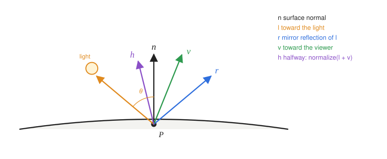
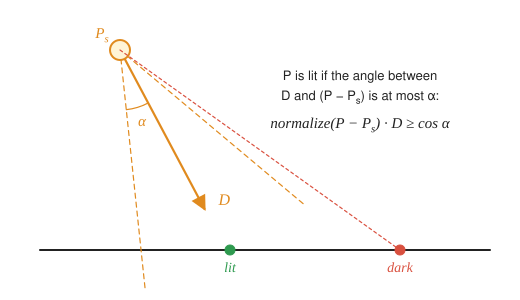

# 7 · Lighting and shading

**You will learn:** the Phong reflection model and Blinn's variant; directional, point and spot lights; the difference between flat, Gouraud and Phong shading; how to transform normals correctly; and how to compute vertex normals for a mesh.

**Demo:** [04 · Lighting and shading](https://luckiday.github.io/graphics-foundations/demos/04-lighting-and-shading.html) · [source](../demos/04-lighting-and-shading.html)

---

## 7.1 Two separate questions

It helps to split "how bright is this pixel?" into two independent choices:

- **Reflection model** (lighting): *given* a surface point, its normal, the light and the viewer, how much light leaves toward the eye? The Phong model below is one answer.
- **Shading frequency**: *where* do we evaluate the model: once per face, once per vertex, or once per pixel?

Demo 04 fixes the model and varies the frequency. It shows three spheres with identical lighting code that look noticeably different.

## 7.2 The Phong reflection model



At surface point $`P`$, with every vector normalized:

| Vector | Points |
|---|---|
| $`𝐧`$ | along the surface normal |
| $`𝐥`$ | from $`P`$ toward the light |
| $`𝐯`$ | from $`P`$ toward the viewer |
| $`𝐫`$ | along the mirror reflection of $`𝐥`$: $`\ 𝐫 = 2(𝐧\cdot𝐥)\,𝐧 - 𝐥`$ |

The model adds three terms:

```math
I = \underbrace{k_a\, I_a}_{\text{ambient}}
+ \sum_{\text{lights}} f_{\text{att}} \left(
\underbrace{k_d\, I_l \max(𝐧\cdot𝐥,\, 0)}_{\text{diffuse}}
+ \underbrace{k_s\, I_l \max(𝐫\cdot𝐯,\, 0)^{\alpha}}_{\text{specular}}
\right)
```

Each term is evaluated for red, green and blue separately.

**Ambient.** A constant standing in for light that has bounced around the scene. Without it, surfaces facing away from every light would be pure black. It is a crude approximation of global illumination.

**Diffuse (Lambertian).** A matte surface scatters light equally in all directions. What varies is how much light *arrives*. A beam of fixed width spreads over a larger area when it hits the surface at a slant, by a factor of $`1/\cos\, \theta`$, so the irradiance falls off as $`\cos\, \theta = 𝐧\cdot𝐥`$ (Lambert's cosine law). The diffuse term does not depend on the viewer at all. The $`\max(\cdot, 0)`$ stops surfaces facing away from the light from getting negative light.

**Specular.** Shiny surfaces reflect most strongly near the mirror direction $`𝐫`$. The exponent $`\alpha`$, called shininess, controls how quickly the highlight falls off. Low values (5–10) give broad, dull highlights like plastic; high values (100–1000) give small, sharp ones like polished metal. The specular color is usually the *light's* color, not the surface's. That is why highlights on colored plastic look white.

The Phong model is **empirical**: it looks plausible and is cheap, but it is not derived from physics and does not conserve energy. Modern renderers use physically based models (microfacet BRDFs). They have the same structure, diffuse plus a view-dependent lobe, with better-founded terms.

### Blinn–Phong

Instead of $`𝐫\cdot𝐯`$, Blinn uses the **halfway vector**

```math
𝐡 = \frac{𝐥 + 𝐯}{\lVert 𝐥 + 𝐯 \rVert},
\qquad \text{specular} = k_s\, I_l \max(𝐧\cdot𝐡,\, 0)^{\alpha'}.
```

When the viewer sits exactly in the mirror direction, $`𝐡 = 𝐧`$ and both variants peak. Blinn–Phong's highlight is broader for the same exponent. Roughly, $`\alpha' \approx 4\alpha`$ gives a similar look. It behaves better at grazing angles, and it is what most real-time code uses, including TinyGraphics' `Phong_Shader`.

**Common mistake: highlights on the dark side.** The formulas as written allow specular light when $`𝐧\cdot𝐥 \le 0`$, that is, when the light is behind the surface, because $`𝐧\cdot𝐡`$ can still be positive. Real code sets the specular term to zero whenever $`𝐧\cdot𝐥 \le 0`$. TinyGraphics' `Phong_Shader` and demo 04 both do.

**In TinyGraphics,** $`k_a, k_d, k_s, \alpha'`$ are the material options `ambient`, `diffusivity`, `specularity` and `smoothness`. Its ambient term is `color * ambient`, with no light intensity. The diffuse term is tinted by both the surface `color` and the light's color; the specular term by the light's color only. `ambient` defaults to 0, so a surface facing away from every light is pure black until you set it.

### Light sources

| Type | Represented as | $`𝐥`$ at point $`P`$ | Attenuation |
|---|---|---|---|
| directional (the sun) | direction, $`w = 0`$ | constant | none |
| point | position $`L`$, $`w = 1`$ | $`\mathrm{normalize}(L - P)`$ | yes |
| spot | position, axis $`𝐃`$, cutoff angle | as a point light, but zero outside the cone | yes |

**Attenuation.** Physically, light from a point source falls off as $`1/d^2`$. In practice a softer
$`f_{\text{att}} = \dfrac{1}{k_c + k_l d + k_q d^2}`$
gives artists control and avoids the singularity at $`d = 0`$.

**In TinyGraphics** a light is `new Light(position_or_vector, color, size)`. With $`w = 0`$ the vector points *toward* the light, not along its rays, so using the sun's travel direction lights the back of everything. `Phong_Shader` uses $`f_{\text{att}} = 1/(1 + d^2/\text{size})`$, that is $`k_c = 1`$, $`k_l = 0`$ and $`k_q = 1/\text{size}`$. It applies this even to $`w = 0`$ lights, taking $`d`$ as the length of the stored vector. So `new Light(vec4(0, 1, 0, 0), color(1, 1, 1, 1), 1)` shines at half strength. Give directional lights a huge size, such as `1e6`.

**Spotlight test.** $`P`$ is inside the cone when the angle between the axis and the direction to $`P`$ is at most the cutoff $`\theta_c`$ ($`𝐃`$ must be unit length):



```math
\mathrm{normalize}(P - P_s) \cdot 𝐃 \ \ge\ \cos\, \theta_c.
```

Comparing cosines avoids an `acos`. For a soft edge, fade between an inner and an outer cutoff with `smoothstep`.

## 7.3 Shading frequency: flat, Gouraud, Phong

| Technique | Model evaluated | Interpolated | Look |
|---|---|---|---|
| **flat** | once per triangle (face normal) | nothing | faceted |
| **Gouraud** | once per **vertex**, in the vertex shader | the resulting *color* | smooth, but highlights smear or vanish |
| **Phong** | once per **fragment**, in the fragment shader | the *normal* and position | smooth, with accurate highlights |

Do not confuse the Phong *reflection model* (§7.2) with Phong *shading*, which is this per-pixel interpolation scheme. They are different ideas that happen to share an inventor.

**Why Gouraud misses highlights.** If a sharp highlight falls in the middle of a large triangle, none of its three vertices sees it. Interpolating three dim colors can never produce a bright center. Low tessellation makes this obvious: in demo 04, set the subdivision level to 1 (16 triangles) and let the light orbit. Gouraud also shows **Mach bands**: the eye exaggerates the kinks where the linear color slope changes at triangle edges.

**Why interpolated normals must be re-normalized.** Linearly interpolating two unit vectors produces a vector shorter than 1 between them. The fragment shader must call `normalize(N)` before using it.

In GLSL the only difference between Gouraud and Phong shading is *where* the same function is called:

```glsl
// Gouraud: vertex shader
v_color = shade(world_position, normalize(world_normal));   // out vec3 v_color

// Phong: vertex shader passes the ingredients ...
v_position = world_position;  v_normal = world_normal;
// ... and the fragment shader shades
outColor = vec4(shade(v_position, normalize(v_normal)), 1.0);
```

Every vector in the model must be in the **same space**. TinyGraphics lights in world space: positions go through `model_transform`, normals through the normal matrix (§7.4), and the eye point comes from `camera_transform`. You can light in camera space instead, but then positions, lights and normals all need the view matrix too, and the normal matrix becomes the inverse transpose of $`VM`$. Mixing a camera-space position with a world-space light is a classic bug: the lighting looks almost right and moves when the camera moves.

## 7.4 Transforming normals

A model matrix $`M`$ moves positions and tangent vectors correctly. It does **not** move normals correctly when it contains a non-uniform scale.

**Derivation.** A tangent $`𝐭`$ lies in the surface, so $`𝐧^{𝖳}𝐭 = 0`$. After transformation, the tangent becomes $`M𝐭`$. We want a matrix $`G`$ such that the new normal $`G𝐧`$ is still perpendicular to it:

```math
(G𝐧)^{𝖳}(M𝐭) = 𝐧^{𝖳}\, G^{𝖳} M\, 𝐭 = 0 \quad\text{for every tangent } 𝐭.
```

This holds whenever $`G^{𝖳} M = I`$, that is, when

```math
G = \left(M^{-1}\right)^{𝖳}
```

the **inverse transpose** of the upper-left $`3\times3`$ of $`M`$. Translation does not affect directions, which is why only that block is used.

- For a rotation, $`(R^{-1})^{𝖳} = R`$: normals rotate like everything else.
- For a uniform scale $`sI`$, $`G = \tfrac1s I`$: the direction is unchanged, only the length, and you normalize anyway.
- For a non-uniform scale such as $`S(2, 1, 1)`$, $`G = S(\tfrac12, 1, 1)`$. Stretching a sphere into an ellipsoid along $`x`$ makes its surfaces *less* steep in $`x`$, so the normals tilt away from $`x`$.

TinyGraphics computes this as `Mat4.normal_matrix(model)` and sends it to shaders as `uniform mat3 normal_matrix`.

## 7.5 Computing normals for a mesh

**Face normal** of a triangle $`ABC`$: $`\mathrm{normalize}\big((B - A) \times (C - A)\big)`$.

**Newell's method** for a polygon with vertices $`P_0, \dots, P_{k-1}`$, which may be slightly non-planar. Let $`j = i + 1 \bmod k`$:

```math
n_x = \sum_i (y_i - y_j)(z_i + z_j), \qquad
n_y = \sum_i (z_i - z_j)(x_i + x_j), \qquad
n_z = \sum_i (x_i - x_j)(y_i + y_j).
```

Expanding the products shows that this is exactly $`\sum_i P_i \times P_j`$, the sum of the cross products of consecutive vertex *positions*. For a planar polygon its length is twice the polygon's area. It stays well defined when some vertices are nearly collinear, where a single cross product of two short edges would not.

**Vertex normals for smooth shading** when no analytic surface is available: average the normals of the faces around the vertex. Weighting by face area, which is simply the un-normalized cross product, keeps sliver triangles from dominating. Weighting by the corner angle is even more consistent across different triangulations.

---

## Check yourself

1. A surface at the origin has normal $`𝐧 = (0, 0, 1)`$. A white point light is at $`(0, 3, 4)`$ and the viewer at $`(0, -3, 4)`$. With $`k_a = 0.1`$, $`k_d = 0.6`$, $`k_s = 0.3`$, $`\alpha = 10`$, $`I_a = I_l = 1`$ and no attenuation, compute the Phong intensity. Does Blinn–Phong give the same answer here? Then move the viewer to $`(0, 0, 5)`$ and compute both again, with Blinn–Phong at $`\alpha' = 10`$ and at $`\alpha' = 40`$.
2. What is the major difference between Gouraud and Phong shading, and when do they look the same?
3. A sphere is scaled by $`S(1, 4, 1)`$ into a tall ellipsoid. A student transforms its normals with $`M`$ instead of $`(M^{-1})^{𝖳}`$. Near the equator, which way do the wrong normals lean?
4. Why does the diffuse term not depend on the viewer, while the specular term does?
5. Use Newell's method on the triangle $`(0,0,0)`$, $`(1,0,0)`$, $`(0,1,0)`$. What is its normal, and what is the triangle's area?

<details><summary>Answers</summary>

1. $`𝐥 = (0, 3, 4)/5 = (0, 0.6, 0.8)`$ and $`𝐯 = (0, -0.6, 0.8)`$. $`𝐧\cdot𝐥 = 0.8`$. $`𝐫 = 2(0.8)(0,0,1) - (0, 0.6, 0.8) = (0, -0.6, 0.8) = 𝐯`$, so $`𝐫\cdot𝐯 = 1`$. $`I = 0.1 + 0.6 \cdot 0.8 + 0.3 \cdot 1^{10} = 0.88`$. Blinn: $`𝐡 = \mathrm{normalize}(0, 0, 1.6) = 𝐧`$, so $`𝐧\cdot𝐡 = 1`$ and the intensity is also $`0.88`$. The viewer is exactly in the mirror direction, so both peak. With the viewer at $`(0, 0, 5)`$: $`𝐯 = 𝐧`$, so $`𝐫\cdot𝐯 = 0.8`$ and Phong gives $`I = 0.58 + 0.3 \cdot 0.8^{10} \approx 0.612`$. $`𝐡 = \mathrm{normalize}(0, 0.6, 1.8)`$ and $`𝐧\cdot𝐡 \approx 0.9487`$. Blinn–Phong with $`\alpha' = 10`$ gives $`\approx 0.757`$, a broader, brighter highlight; with $`\alpha' = 40`$ it gives $`\approx 0.616`$, close to Phong. That is the $`\alpha' \approx 4\alpha`$ rule.
2. Gouraud evaluates lighting at vertices and interpolates colors. Phong interpolates normals and evaluates lighting per pixel. They match when lighting varies slowly across each triangle: finely tessellated meshes and no sharp highlights. On a coarse mesh even a purely diffuse surface differs, most visibly along the shadow edge, where the clamp in $`\max(𝐧\cdot𝐥, 0)`$ bends the result.
3. $`M`$ stretches $`y`$ by 4. The ellipsoid's true normals near the equator are *flatter* (closer to horizontal) than the sphere's, but multiplying by $`M`$ stretches their $`y`$ component, so the wrong normals lean too far toward $`\pm y`$ (up or down). The correct matrix divides $`y`$ by 4.
4. An ideal diffuse surface scatters arriving light equally in every direction, so the amount leaving toward any viewer is the same. Specular reflection concentrates light near the mirror direction, so what you see depends on where you stand.
5. $`n_x = n_y = 0`$ (all $`z = 0`$). $`n_z = (0-1)(0+0) + (1-0)(0+1) + (0-0)(1+0) = 1`$. The normal is $`(0,0,1)`$ and the area is $`1/2`$.

</details>

## Further reading

- Bui Tuong Phong, "Illumination for computer generated pictures", *Communications of the ACM*, 1975.
- James F. Blinn, "Models of light reflection for computer synthesized pictures", SIGGRAPH 1977.
- [LearnOpenGL: Basic lighting](https://learnopengl.com/Lighting/Basic-Lighting) and [Advanced lighting](https://learnopengl.com/Advanced-Lighting/Advanced-Lighting).
- Matt Pharr, Wenzel Jakob, Greg Humphreys, *Physically Based Rendering* ([online](https://pbr-book.org/)), for where lighting goes next.
