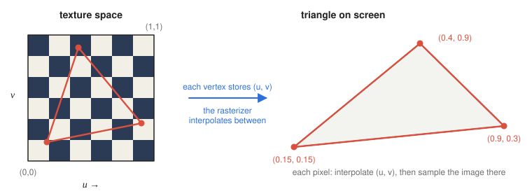
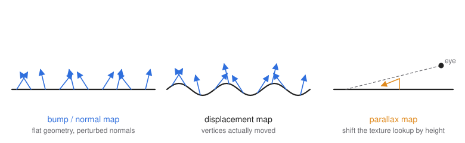

# 8 · Texture mapping

**You will learn:** how texture coordinates attach an image to a surface; common ways to generate them; how GPUs filter textures to avoid aliasing (bilinear filtering, mipmaps); why texture coordinates must be interpolated with perspective correction; and how bump, normal, displacement and parallax maps fake geometric detail.

**Demo:** [05 · Texture mapping](https://luckiday.github.io/graphics-foundations/demos/05-texture-mapping.html) · [source](../demos/05-texture-mapping.html)

---

## 8.1 Why textures

Real surfaces are full of small-scale detail: wood grain, brick, fabric weave, scratches. Modeling that detail with triangles would take millions of vertices. **Texture mapping** stores the detail in an image instead and looks the image up when shading each fragment. The geometry stays simple and the pixels carry the detail.

## 8.2 Texture coordinates



A texture is addressed with **texture coordinates** $`(u, v) \in [0, 1]^2`$. $`(0, 0)`$ is the image's bottom-left and $`(1, 1)`$ its top-right, regardless of its pixel resolution. Each vertex stores a $`(u, v)`$ pair alongside its position. The rasterizer interpolates $`(u, v)`$ across each triangle, and the fragment shader samples the image there:

```glsl
in vec2 f_uv;
uniform sampler2D image;
out vec4 color;
void main() {
    color = texture(image, f_uv);
}
```

The GPU interpolates $`(u, v)`$ between vertices. Textures are therefore **sampled in the fragment stage**, even though the coordinates are *assigned* at vertices.

### Generating texture coordinates

Assigning $`(u, v)`$ is called **parameterization**. A few standard mappings:

| Mapping | $`(u, v)`$ for a point $`(x, y, z)`$ | Good for | Artifact |
|---|---|---|---|
| planar | $`(x, y)`$, scaled | floors, walls, decals | stretching on faces parallel to the projection |
| cylindrical | $`\left(\frac{\operatorname{atan2}(z, x)}{2\pi} + \frac12,\ \ y\right)`$ | cans, trunks, columns | a seam where $`u`$ wraps from 1 to 0 |
| spherical | $`\left(\frac{\operatorname{atan2}(z, x)}{2\pi} + \frac12,\ \ \frac{\arcsin y}{\pi} + \frac12\right)`$ | planets, skies | pinching at the poles |
| per-face | each face gets the whole $`[0,1]^2`$ | cubes, boxes | none, but requires split vertices |
| authored (UV unwrapping) | chosen by an artist in Blender, Maya, … | characters, props | none if done well |

A seam, where $`u`$ jumps from 1 back to 0, needs **duplicated vertices**. A single vertex cannot hold both $`u = 1`$ for the triangle on one side and $`u = 0`$ for the triangle on the other (chapter 3).

**Wrap modes** decide what happens outside $`[0, 1]`$: `REPEAT` tiles the image, `MIRRORED_REPEAT` tiles it with alternate copies flipped, `CLAMP_TO_EDGE` stretches the border pixels.

## 8.3 Sampling and filtering

A texture is a grid of **texels**, and a fragment's $`(u, v)`$ rarely lands exactly on a texel center.

**Magnification** happens when one texel covers many screen pixels, as with a close-up wall:

- `NEAREST` picks the closest texel. Result: blocky.
- `LINEAR` blends the four surrounding texels by distance (**bilinear** interpolation). Result: smooth but soft.

**Minification** happens when many texels fall inside one pixel, as with a distant floor. Sampling just one or four of them skips most of the image, so the result shimmers and shows moiré patterns as the camera moves. This is **aliasing**: the signal has detail finer than the pixel grid can represent.

**Mipmaps** pre-filter the texture. A mipmap chain stores the image at full size, then half size, quarter size, and so on down to $`1\times1`$. Each level averages the level above it, and the whole chain costs only $`\tfrac13`$ more memory. The GPU chooses a level where one texel is about one pixel, using the screen-space rate of change of $`(u, v)`$ (the `dFdx`/`dFdy` derivatives). `LINEAR_MIPMAP_LINEAR` (**trilinear** filtering) interpolates bilinearly within the two nearest levels and blends between them.

A floor seen at a glancing angle is minified much more along one screen axis than the other. Mipmaps pick the level for the worse axis and blur the other. **Anisotropic filtering** takes several samples along the long axis to keep the image sharp.

Try all three filters in demo 05, and tilt the camera toward the horizon.

## 8.4 Perspective-correct interpolation

The rasterizer works in **screen space**. Linearly interpolating $`(u, v)`$ between a triangle's projected vertices is wrong under perspective.

Consider a floor receding into the distance. Its far half covers far fewer pixels than its near half. So equal steps in *screen* space must correspond to *unequal* steps in texture space. Plain screen-space ("affine") interpolation spreads the texture evenly across the pixels instead, and the texture visibly bends along each triangle's diagonal. Demo 05's *affine* mode shows exactly this, which is the classic warping seen in early 3D games.

**The fix.** An attribute $`a`$ varies linearly across the triangle in 3D. After projection, it is not $`a`$ but $`a/w`$, along with $`1/w`$, that varies **linearly in screen space**. With screen-space barycentric weights $`\lambda_i`$ for the three vertices:

```math
a = \frac{\sum_i \lambda_i\, a_i / w_i}{\sum_i \lambda_i / w_i}.
```

Here $`w_i`$ is each vertex's clip-space $`w`$, its depth in camera space. GPUs apply this formula automatically to every vertex shader output, which is why demo 05 has to work to *disable* it.

## 8.5 Faking geometry: bump, normal, displacement and parallax maps



Lighting depends on the **normal**, not on the actual geometry. Change the normal and a flat surface *looks* bumpy.

**Bump mapping** stores a grayscale **height** $`h(u, v)`$. The shader perturbs the normal using the height's slope, $`\partial h / \partial u`$ and $`\partial h / \partial v`$, along the surface's tangent directions. The geometry is unchanged: silhouettes stay perfectly straight and bumps cast no shadows.

**Normal mapping** stores the perturbed normal directly, as RGB in **tangent space**: a frame made of the surface's tangent $`\mathbf{T}`$, bitangent $`\mathbf{B}`$ and normal $`\mathbf{N}`$ at each point. The shader rotates the stored normal into world space with the $`3\times3`$ matrix $`[\mathbf{T}\ \mathbf{B}\ \mathbf{N}]`$. It is the standard technique in games. Normal maps are usually "baked" from a high-polygon sculpt onto a low-polygon model.

**Displacement mapping** actually moves the vertices along their normals by $`h(u, v)`$. It needs dense geometry, from pre-tessellation or a tessellation shader, but it changes silhouettes and occlusion correctly.

**Parallax mapping** shifts the texture lookup toward the viewer in proportion to height. Nearer bumps then appear to slide over farther ones as the view changes. It adds depth at almost no cost; *parallax occlusion mapping* ray-marches the height field for accurate self-occlusion.

| | changes normals | changes silhouette | cost |
|---|---|---|---|
| bump / normal map | yes | no | one extra texture lookup |
| parallax map | yes, plus shifted lookup | no | a few lookups |
| displacement map | yes (recomputed) | **yes** | many more vertices |

TinyGraphics' `Fake_Bump_Map` shader simply adds the texture color to the normal. It ignores tangent space, so the effect is only roughly right. Implementing proper tangent-space normal mapping is a good exercise.

## 8.6 Environment mapping

A mirror-like object reflects its surroundings. **Environment mapping** approximates this by looking up a direction instead of a position. The shader computes the reflection vector $`\mathbf{r} = \operatorname{reflect}(-\mathbf{v}, \mathbf{n})`$ and samples a **cube map**, six images forming a box around the scene, in that direction. The same cube map drawn around the camera is a **skybox** (chapter 12). The approximation assumes the environment is infinitely far away, so nearby objects are not reflected correctly. For those, see mirrors in chapter 10 and ray tracing in chapter 11.

---

## Check yourself

1. True or false, with a reason:
   (a) Textures are applied in the vertex processing stage.
   (b) Texture coordinates are usually assigned at vertices and interpolated across each triangle.
   (c) Bump mapping fixes the stretching that appears when a planar wood texture is applied to a curved object.
2. A 1024 × 1024 texture covers a quad that is 64 pixels wide on screen. Roughly which mipmap level is used? (Level 0 is full size.)
3. A triangle's vertices have $`u = 0`$ and $`u = 1`$, at clip-space $`w = 1`$ and $`w = 3`$. What is $`u`$ at the screen-space midpoint of that edge, with and without perspective correction?
4. Why must a cylinder's texture seam use duplicated vertices?
5. Why does a normal-mapped brick wall look wrong when you look along it at a glancing angle, while a displacement-mapped one does not?

<details><summary>Answers</summary>

1. (a) False. Texture *coordinates* pass through the vertex stage, but sampling happens per fragment. (b) True. (c) False. Bump mapping perturbs normals to fake relief; it does nothing about how the image is parameterized. Stretching needs better texture coordinates.
2. $`1024 / 64 = 16`$ texels per pixel $`= 2^4`$, so level **4**, which is $`64 \times 64`$ texels.
3. Affine: $`\lambda = \tfrac12`$, so $`u = 0.5`$. Perspective-correct: $`u = \dfrac{\tfrac12 \cdot 0/1 + \tfrac12 \cdot 1/3}{\tfrac12 \cdot 1/1 + \tfrac12 \cdot 1/3} = \dfrac{1/6}{2/3} = 0.25`$. The far vertex ($`w = 3`$) is compressed on screen, so the screen midpoint lies closer to the near end in texture space.
4. The vertex on the seam belongs to triangles that need $`u = 1`$ on one side and $`u = 0`$ on the other. A shared vertex would make one triangle interpolate from about 0.97 back down to 0, squeezing the whole texture into that one strip.
5. Normal mapping leaves the geometry flat. At glancing angles you see a flat silhouette, and no brick hides the mortar behind it. Displacement actually moves the surface, so the silhouette and occlusion are real.

</details>

## Further reading

- Paul Heckbert, "Survey of texture mapping", *IEEE CG&A*, 1986.
- [LearnOpenGL: Textures](https://learnopengl.com/Getting-started/Textures), [Normal mapping](https://learnopengl.com/Advanced-Lighting/Normal-Mapping), [Parallax mapping](https://learnopengl.com/Advanced-Lighting/Parallax-Mapping).
- [Exploring bump mapping with WebGL](https://apoorvaj.io/exploring-bump-mapping-with-webgl/): an interactive comparison of these techniques.
