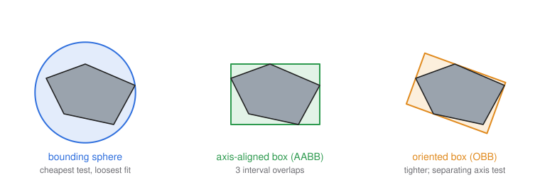
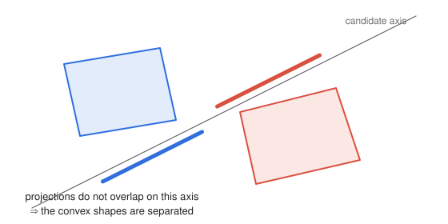

# 9 · Collision detection

**You will learn:** why testing every triangle against every other triangle is hopeless; how bounding volumes (spheres, axis-aligned boxes and oriented boxes) make collision tests cheap; the separating axis theorem; broad-phase techniques that avoid testing every pair; and the time-stepping problems that let fast objects pass through each other.

**Demo:** [07 · Collision detection with bounding volumes](https://luckiday.github.io/graphics-foundations/demos/07-bounding-volumes.html) · [source](../demos/07-bounding-volumes.html)

---

## 9.1 The problem

Collision detection asks one question each frame: *which objects are touching?* The exact answer would test every triangle of every object against every triangle of every other object. Ten objects of 1,000 triangles each give $`\binom{10}{2} \times 1000^2 = 45`$ million triangle-pair tests, per frame. Games and simulations with hundreds of objects need a far cheaper approach.

The standard answer has two phases:

1. **Broad phase.** Cheaply find the *pairs that might* collide, using simple bounding volumes and spatial data structures.
2. **Narrow phase.** For those candidate pairs only, run an exact, or at least tighter, test.

A false positive from the broad phase costs one extra narrow-phase test. A false negative is a missed collision. Bounding volumes are therefore built to be *conservative*: they always contain the whole object.

## 9.2 Bounding volumes



| Volume | Stored as | Overlap test | Fit |
|---|---|---|---|
| sphere | center $`\mathbf{c}`$, radius $`r`$ | 1 distance comparison | loose for long, thin objects |
| axis-aligned bounding box (AABB) | $`\mathbf{min}`$, $`\mathbf{max}`$ corners | 3 interval comparisons | good if aligned with the axes, poor when rotated |
| oriented bounding box (OBB) | center, 3 axes, 3 half-extents | separating axis test, 15 axes | tight for most rigid shapes |
| convex hull | vertices and faces | SAT or GJK | tightest convex fit |

### Spheres

Two spheres intersect when the distance between their centers is at most the sum of their radii. Compare **squared** distances to avoid a square root:

```js
function spheres_overlap(a, b) {
    const d = a.center.minus(b.center);
    const r = a.radius + b.radius;
    return d.dot(d) <= r * r;
}
```

A sphere is rotation-invariant, so it never needs updating when the object turns, only when it moves.

**Fitting a sphere.** Centering it at the average vertex, with the radius reaching the farthest vertex, is easy but loose. **Ritter's algorithm** is a fast approximation: start from the two most distant points found in a quick pass, then grow the sphere to include each outlier. It is typically within 5–20% of the optimal radius. **Welzl's algorithm** finds the exact minimal sphere in expected linear time.

### Axis-aligned boxes

Two AABBs overlap only if their intervals overlap on **every** axis. They are separated as soon as the intervals are disjoint on *any* axis:

```js
function aabbs_overlap(a, b) {
    return a.min[0] <= b.max[0] && a.max[0] >= b.min[0]
        && a.min[1] <= b.max[1] && a.max[1] >= b.min[1]
        && a.min[2] <= b.max[2] && a.max[2] >= b.min[2];
}
```

Each comparison can exit early, so the common case of well-separated objects is very cheap. When an object rotates, its AABB must be recomputed. Transforming the eight corners of the local box and taking the min and max is fast and conservative, though looser than refitting the actual vertices.

## 9.3 The separating axis theorem



**Theorem.** Two convex shapes do **not** intersect if and only if there is a line, called a *separating axis*, onto which their projections do not overlap.

Only finitely many axes need testing:

| Shapes | Candidate axes |
|---|---|
| two convex polygons in 2D | the normal of every edge of both polygons |
| two convex polyhedra in 3D | every face normal of both, plus the cross product of every edge of one with every edge of the other |
| two OBBs | 3 + 3 face axes + 3 × 3 edge-pair cross products = **15** |

**Projecting** a shape onto an axis $`\mathbf{a}`$ means taking the minimum and maximum of $`\mathbf{p}\cdot\mathbf{a}`$ over its vertices. For a box, center $`\pm`$ extents is enough.

```js
function convex_polygons_overlap(P, Q) {                 // arrays of [x, y], convex, in order
    for (const poly of [P, Q])
        for (let i = 0; i < poly.length; i++) {
            const [x1, y1] = poly[i], [x2, y2] = poly[(i + 1) % poly.length];
            const axis = [y2 - y1, x1 - x2];             // edge normal
            const proj = pts => pts.map(([x, y]) => x * axis[0] + y * axis[1]);
            const p = proj(P), q = proj(Q);
            if (Math.max(...p) < Math.min(...q) || Math.max(...q) < Math.min(...p)) return false;  // found a gap
        }
    return true;                                         // no separating axis exists
}
```

Demo 07 uses exactly this function for its narrow phase. Its orange shapes are **false positives**: their bounding volumes overlap, but SAT proves the shapes themselves do not.

The theorem requires **convex** shapes. A concave object is split into convex pieces, or handled with a hierarchy of bounding volumes that ends at individual triangles.

## 9.4 Broad phase: avoiding $`O(n^2)`$

Testing every pair of $`n`$ objects, even with spheres, grows as $`n^2/2`$. For large $`n`$, organize space so that only nearby pairs are tested:

- **Uniform grid / spatial hashing.** Put each object into the cells its bounding box touches, and test only objects that share a cell. Excellent when objects are of similar size.
- **Sweep and prune.** Sort the AABB interval endpoints along one axis. Only objects whose intervals overlap on that axis become candidates. Between frames the order barely changes, so an insertion sort re-sorts it almost for free.
- **Bounding volume hierarchies (BVH)** and **octrees**. Trees of nested volumes. A query descends only into children whose volume it hits. The same structures accelerate ray tracing (chapter 11).

## 9.5 Collisions over time

Simulations advance in discrete steps. Two problems follow.

**Tunneling.** A fast object can be on one side of a thin wall in one frame and past it in the next, and a per-frame overlap test never sees contact. Remedies:
- **Smaller time steps.**
- **Swept volumes:** test the capsule or box covering an object's whole motion during the step.
- **Continuous collision detection:** solve for the time of first contact within the step.

**Fixed time steps.** Stepping physics by the variable frame time makes results depend on frame rate. Collisions are missed on slow machines and behavior changes as load changes. The robust pattern accumulates real elapsed time and advances the simulation in *fixed* increments $`\Delta t`$. When drawing, it interpolates between the last two states:

```js
accumulator += Math.min(frame_seconds, 0.1);       // cap to avoid a "spiral of death" after a stall
while (accumulator >= dt) {
    step_simulation(dt);                            // detect & resolve collisions here
    accumulator -= dt;
}
const alpha = accumulator / dt;                     // draw at blend(previous_state, current_state, alpha)
```

**Response.** Detection tells you *that* objects collide. Response decides what happens next. The simplest response separates the objects along the contact normal, so they no longer overlap, and reflects the velocity component along that normal, scaled by a restitution coefficient $`e \in [0, 1]`$:

```math
\mathbf{v}' = \mathbf{v} - (1 + e)\,(\mathbf{v}\cdot\hat{\mathbf{n}})\,\hat{\mathbf{n}}.
```

$`e = 1`$ is a perfectly elastic bounce; $`e = 0`$ stops the motion along the normal.

---

## Check yourself

1. Sphere A has center $`(0, 0, 0)`$ and radius 2; sphere B has center $`(3, 3, 0)`$ and radius 2. Do they intersect? Answer without taking a square root.
2. AABB A spans $`[0, 2] \times [0, 2] \times [0, 2]`$ and AABB B spans $`[1, 3] \times [2.5, 4] \times [0, 1]`$. Do they overlap? On which axis are they separated?
3. Why is an AABB a poor bounding volume for a long, thin stick rotated 45°? What would you use instead?
4. How many separating axes must be tested for two triangles in 3D?
5. A ball moves at 30 m/s toward a wall 5 cm thick, simulated at 60 steps per second. Can a per-step overlap test miss the collision?
6. A ball hits the floor ($`\hat{\mathbf{n}} = (0, 1, 0)`$) with velocity $`(2, -5, 0)`$. With $`e = 0.8`$, what is its velocity after the bounce?

<details><summary>Answers</summary>

1. The squared distance is $`9 + 9 = 18`$ and the squared radius sum is $`(2 + 2)^2 = 16`$. Since $`18 \gt 16`$, they do not intersect.
2. $`x`$: $`[0, 2]`$ and $`[1, 3]`$ overlap. $`y`$: $`[0, 2]`$ and $`[2.5, 4]`$ are disjoint. So the boxes do **not** overlap; they are separated along $`y`$.
3. The AABB of a diagonal stick is a square that is mostly empty space, so it overlaps many things the stick does not. Use an OBB aligned with the stick, or a capsule.
4. 2 face normals, plus $`3 \times 3 = 9`$ edge-pair cross products, for 11 in all. (Degenerate, parallel cases need care.)
5. Yes. Each step moves the ball $`30 / 60 = 0.5`$ m, ten times the wall's thickness. The ball can be in front of the wall at one step and behind it at the next without ever overlapping it.
6. $`\mathbf{v}\cdot\hat{\mathbf{n}} = -5`$, so $`\mathbf{v}' = (2, -5, 0) - 1.8 \cdot (-5)(0, 1, 0) = (2, -5 + 9, 0) = (2, 4, 0)`$.

</details>

## Further reading

- Christer Ericson, *Real-Time Collision Detection*, chapters 4–5 (bounding volumes, SAT) and 7 (spatial partitioning).
- Glenn Fiedler, ["Fix Your Timestep!"](https://gafferongames.com/post/fix_your_timestep/).
- Emo Welzl, "Smallest enclosing disks (balls and ellipsoids)", 1991.
