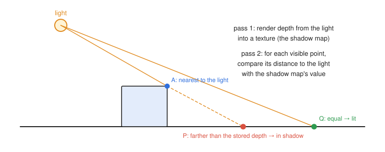
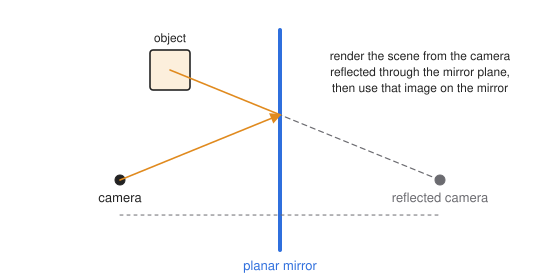

# 10 · Shadows, mirrors and transparency

**You will learn:** why a rasterizer cannot see shadows or reflections directly; shadow mapping and its artifacts; planar mirrors by rendering from a reflected camera; and alpha blending, premultiplied alpha, and why transparent objects must be sorted.

**Try it:** [TinyGraphics `Scene_To_Texture_Demo`](https://github.com/intro-graphics/TinyGraphics.js/blob/v2/examples/scene-to-texture-demo.js), the two-pass structure all of these effects share.

---

## 10.1 The limitation of local lighting

The lighting of chapter 7 is **local**: a fragment shader knows its own position, normal, the light and the eye, and nothing else. It cannot ask *"is some other object between me and the light?"* (shadows) or *"what does the world look like in my mirror direction?"* (reflections). A rasterizer draws each triangle independently, so these **global** effects need extra machinery. The usual answer is to render the scene more than once and pass information between the passes as textures.

## 10.2 Shadow mapping



**Idea.** A point is in shadow when it is *not the nearest thing the light can see* in its direction. Instead of asking, for every point, "which lights can see me?", render once from the light and remember what it sees.

**Pass 1 — from the light.** Put the camera at the light: a perspective projection for a spotlight, orthographic for a directional light. Render the scene's **depth** into a texture, the **shadow map**. Each texel stores the depth of the nearest surface along that ray from the light. A point light shines in every direction, so no single frustum covers it: render six $`90°`$ passes into a cube map (an *omnidirectional* shadow map), or treat it as a spotlight. TinyGraphics lights with $`w = 1`$ are point lights.

**Pass 2 — from the eye.** Render normally. For each fragment:

```
p_light = LightProjection · LightView · world_position     // same matrices as pass 1
uv, depth = p_light.xy / p_light.w * 0.5 + 0.5, p_light.z / p_light.w * 0.5 + 0.5
in_shadow = depth - bias > texture(shadow_map, uv).r
color = ambient + (in_shadow ? 0 : diffuse + specular)
```

`Render_Target` in TinyGraphics.js gives you the off-screen pass, but only its **color** texture can be sampled; its depth buffer is a renderbuffer. Either have the pass-1 fragment shader write depth into color (8 bits per channel is too coarse, so spread the value over several channels), or attach a `DEPTH_COMPONENT` texture to a framebuffer of your own. Whatever you store, pass 2 must compute the same quantity before comparing. Fragments whose `uv` falls outside $`[0, 1]`$, or whose depth is past 1, are outside the light's view: treat them as lit rather than sampling the clamped edge of the map. [WebGL2 Fundamentals: shadows](https://webgl2fundamentals.org/webgl/lessons/webgl-shadows.html) walks through a complete implementation.

**Artifacts, and their standard fixes:**

| Artifact | Cause | Fix |
|---|---|---|
| **shadow acne**: stripes of false shadow on lit surfaces | the surface compares against its own slightly-off depth | subtract a small **bias**, larger where light arrives at a grazing angle, for example $`\max(b_0\,(1 - 𝐧\cdot𝐥),\ b_{\min})`$ |
| **peter-panning**: shadows detach from their casters | too much bias | a smaller, slope-scaled bias; render back faces into the map |
| **jagged edges** | one shadow-map texel covers many screen pixels | higher resolution; **percentage-closer filtering** (average several comparisons); cascaded shadow maps for large scenes |

**Cheaper alternatives.** A blurred dark disc under each object ("blob shadow"). Projecting each object flat onto the ground plane with a squashing matrix and drawing it dark. Or **baking** shadows into textures ahead of time, for static scenes.

## 10.3 Planar mirrors



A flat mirror shows the scene as seen by a camera **reflected through the mirror plane**. Chapter 4's reflection matrix gives that camera directly:

```math
V_{\text{mirror}} = V\, F, \qquad F = T(𝐩_0)\,\left(I - 2\hat{𝐧}\hat{𝐧}^{𝖳}\right)T(-𝐩_0),
```

for a mirror plane through $`𝐩_0`$ with unit normal $`\hat{𝐧}`$.

1. Render the scene with $`V_{\text{mirror}}`$ into a texture. A reflection reverses winding order, so flip the culled face. Clip away everything behind the mirror plane, or objects behind the mirror appear in it.
2. Draw the mirror surface and texture it with that image, using the projected screen position as texture coordinates.

The alternative skips the texture: draw the reflected scene directly into the mirror's pixels, using the **stencil buffer** to confine drawing to the mirror's shape.

Curved and many-bounce reflections do not have a single reflected camera. They are approximated with environment maps (chapter 8) or computed exactly by ray tracing (chapter 11).

## 10.4 Transparency and blending

A fragment's **alpha** $`A \in [0, 1]`$ is its opacity. Drawing a translucent fragment with color $`C_s`$ and alpha $`A_s`$ over a destination color $`C_d`$ uses the **over** operator:

```math
C = A_s\, C_s + (1 - A_s)\, C_d .
```

In WebGL: `gl.enable(gl.BLEND); gl.blendFunc(gl.SRC_ALPHA, gl.ONE_MINUS_SRC_ALPHA)`. TinyGraphics sets exactly this for you. It also applies the formula to the canvas's own alpha, which leaves a canvas partly transparent wherever a translucent fragment lands, so the page shows through. To keep the canvas opaque, blend alpha separately: `gl.blendFuncSeparate(gl.SRC_ALPHA, gl.ONE_MINUS_SRC_ALPHA, gl.ONE, gl.ONE_MINUS_SRC_ALPHA)`.

**Order matters.** "Over" is not commutative, and the z-buffer (chapter 6) keeps only one depth per pixel. A translucent surface drawn first writes its depth, and a surface behind it that is drawn later is discarded, so it never shows through. The standard recipe:

1. Draw all **opaque** objects first, with depth testing and depth writing enabled.
2. **Sort** translucent objects from **back to front** by distance from the camera.
3. Draw them in that order with depth *testing* on and depth *writing* off (`gl.depthMask(false)`).

Sorting by object is only approximate: intersecting or interlocking translucent objects have no correct order. **Order-independent transparency** techniques, such as depth peeling and weighted blended OIT, address this at extra cost.

### Premultiplied alpha

Store color already multiplied by its alpha: $`\tilde{C} = A\,C`$. The over operator then becomes

```math
\tilde{C} = \tilde{C}_s + (1 - A_s)\,\tilde{C}_d, \qquad A = A_s + (1 - A_s)\,A_d .
```

Premultiplied alpha has several advantages:

- Color and alpha combine with the **same formula**, so compositing several layers is associative.
- Filtering and mipmapping stop producing dark or bright fringes around cut-out edges.
- Additive glows are expressible directly: $`A = 0`$ with nonzero color.

The WebGL settings are `gl.blendFunc(gl.ONE, gl.ONE_MINUS_SRC_ALPHA)`. The colors must then really be premultiplied: output `vec4(color.rgb * color.a, color.a)` from the shader, or upload textures with `gl.pixelStorei(gl.UNPACK_PREMULTIPLY_ALPHA_WEBGL, true)`. TinyGraphics' `Texture` uploads straight alpha, and mixing the two conventions brightens every translucent edge. Particle systems and compositing pipelines use this form almost universally.

---

## Check yourself

1. Two particles cover one pixel. Particle 1 is in front, with premultiplied color and alpha $`(0.1, 0.1, 0.0, 0.2)`$. Particle 2 is behind, with $`(0.1, 0.0, 0.1, 0.4)`$. The background is black and transparent. What is the composited premultiplied RGBA?
2. You see thin diagonal stripes of shadow on a lit floor. What is happening and how do you fix it?
3. Why does a mirror image need back-face culling reversed?
4. You draw a glass window, then a wall behind it, both with depth writing on. The wall never shows through the glass. Why?
5. A directional light shines along $`(0, -1, 0)`$. What kind of projection should its shadow-map pass use, and why?

<details><summary>Answers</summary>

1. Composite front over back. Color: $`(0.1, 0.1, 0.0) + (1 - 0.2)(0.1, 0.0, 0.1) = (0.18, 0.10, 0.08)`$. Alpha: $`0.2 + 0.8 \cdot 0.4 = 0.52`$. The result is $`(0.18, 0.10, 0.08, 0.52)`$.
2. Shadow acne: each surface compares against its own depth, stored at shadow-map resolution with limited precision, and about half the comparisons come out "farther". Add a small, slope-scaled depth bias, and consider rendering back faces into the shadow map.
3. A reflection has determinant $`-1`$, so it reverses the orientation of every triangle. Counter-clockwise front faces become clockwise, and normal culling would discard exactly the faces that should be visible.
4. The glass wrote its depth first. The wall's fragments are farther away, so they fail the depth test and are never blended. Draw opaque objects first, then translucent ones back to front with depth writing off.
5. Orthographic. A directional light's rays are parallel, which is exactly what an orthographic projection models. A perspective projection would make the rays diverge from a point.

</details>

## Further reading

- Lance Williams, "Casting curved shadows on curved surfaces", SIGGRAPH 1978: the original shadow-map paper.
- Thomas Porter and Tom Duff, "Compositing digital images", SIGGRAPH 1984: the over operator and premultiplied alpha.
- [LearnOpenGL: Shadow mapping](https://learnopengl.com/Advanced-Lighting/Shadows/Shadow-Mapping).
