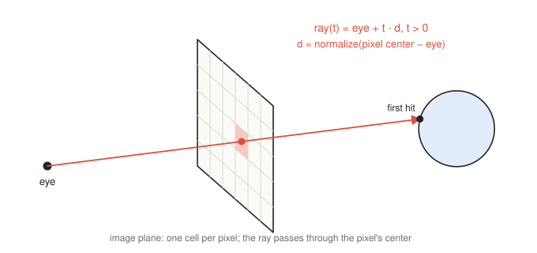
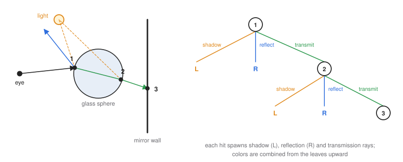

# 11 · Ray tracing

**You will learn:** how ray tracing inverts the rasterization pipeline; how to generate a ray for each pixel; ray intersections with spheres, planes and triangles; shadow, reflection and refraction rays; the ray tree and its cost; and how acceleration structures make ray tracing practical.

**Demo:** [06 · Ray tracing](https://luckiday.github.io/graphics-foundations/demos/06-ray-tracing.html) · [source](../demos/06-ray-tracing.html)

---

## 11.1 Rasterization versus ray tracing

| | Rasterization | Ray tracing |
|---|---|---|
| outer loop | for each **triangle** | for each **pixel** |
| inner loop | which pixels does it cover? | which surface does the ray hit first? |
| visibility | z-buffer | nearest intersection |
| shadows, reflections, refraction | extra passes and approximations (chapter 10) | follow more rays |
| cost | grows with scene size; very GPU-friendly | grows with pixels × ray depth; needs acceleration structures |

**Ray casting** shoots one ray per pixel and shades the first hit, which gives the same image as rasterization. **Ray tracing**, often called Whitted-style after Turner Whitted's 1980 paper, keeps following rays from each hit toward lights, along mirror reflections and through transparent materials. That gives shadows, reflections and refraction naturally.

## 11.2 Generating primary rays



A ray is a half-line $`\mathbf{r}(t) = \mathbf{o} + t\,\mathbf{d}`$ with $`t \gt 0`$. For pixel $`(i, j)`$ of a $`W \times H`$ image, where $`j = 0`$ is the top row, with vertical field of view $`\theta`$ and aspect ratio $`a = W/H`$:

```math
x = \left(\frac{2(i + 0.5)}{W} - 1\right) a \tan\frac{\theta}{2},
\qquad
y = \left(1 - \frac{2(j + 0.5)}{H}\right) \tan\frac{\theta}{2}.
```

In camera space the ray starts at the eye and passes through $`(x, y, -1)`$. In world space, using the look-at basis $`\mathbf{u}, \mathbf{v}, \mathbf{n}`$ from chapter 6:

```math
\mathbf{o} = \text{eye}, \qquad \mathbf{d} = \operatorname{normalize}(x\,\mathbf{u} + y\,\mathbf{v} - \mathbf{n}).
```

The $`+0.5`$ aims at the pixel's center. Shooting several jittered rays per pixel and averaging them **anti-aliases** the image.

## 11.3 Intersections

For each ray, find the smallest $`t \gt \varepsilon`$ at which it meets any object. The small $`\varepsilon`$ keeps a secondary ray from immediately re-hitting the surface it starts on, a bug called "surface acne".

### Sphere

A sphere with center $`\mathbf{c}`$ and radius $`R`$: substitute $`\mathbf{r}(t)`$ into $`\lVert \mathbf{p} - \mathbf{c} \rVert^2 = R^2`$. With $`\mathbf{d}`$ normalized and $`\mathbf{m} = \mathbf{o} - \mathbf{c}`$:

```math
t^2 + 2(\mathbf{m}\cdot\mathbf{d})\,t + (\mathbf{m}\cdot\mathbf{m} - R^2) = 0
\quad\Rightarrow\quad
t = -b \pm \sqrt{b^2 - c}, \qquad b = \mathbf{m}\cdot\mathbf{d},\ c = \mathbf{m}\cdot\mathbf{m} - R^2.
```

- A negative discriminant means a miss.
- Otherwise take the smaller root if it is greater than $`\varepsilon`$, else the larger one (the ray starts inside the sphere).
- The normal at the hit point $`\mathbf{p}`$ is $`(\mathbf{p} - \mathbf{c})/R`$.

### Plane

A plane with normal $`\mathbf{n}`$ through point $`\mathbf{q}`$, i.e. $`(\mathbf{p} - \mathbf{q})\cdot\mathbf{n} = 0`$:

```math
t = \frac{(\mathbf{q} - \mathbf{o})\cdot\mathbf{n}}{\mathbf{d}\cdot\mathbf{n}},
```

with no hit when $`\mathbf{d}\cdot\mathbf{n} \approx 0`$ (the ray is parallel to the plane).

### Triangle

1. Intersect the ray with the triangle's plane, whose normal is $`(B - A) \times (C - A)`$.
2. Decide whether the hit point $`\mathbf{p}`$ lies inside the triangle. Compute its barycentric coordinates (chapter 2): inside means all three are $`\ge 0`$. Equivalently, $`\mathbf{p}`$ must be on the inner side of all three edges: $`\big((B - A)\times(\mathbf{p} - A)\big)\cdot\mathbf{n} \ge 0`$, and likewise for edges $`BC`$ and $`CA`$.

The **Möller–Trumbore** algorithm combines both steps into one small linear solve for $`(t, \beta, \gamma)`$. It is the standard implementation.

### Worked example

Ray from the origin through $`(1, 1, 1)`$; triangle $`A = (0, 4, 0)`$, $`B = (8, 0, 0)`$, $`C = (0, 0, 8)`$.

1. **Ray:** $`\mathbf{r}(t) = (t, t, t)`$.
2. **Plane:** the intercepts $`x = 8`$, $`y = 4`$, $`z = 8`$ give $`\frac{x}{8} + \frac{y}{4} + \frac{z}{8} = 1`$, or $`x + 2y + z = 8`$, with normal $`(1, 2, 1)`$.
3. **Intersection:** $`t + 2t + t = 8`$, so $`t = 2`$ and $`\mathbf{p} = (2, 2, 2)`$.
4. **Inside?** Solve $`\mathbf{p} = \alpha A + \beta B + \gamma C`$. From $`y`$: $`4\alpha = 2`$, so $`\alpha = 0.5`$. From $`x`$: $`8\beta = 2`$, so $`\beta = 0.25`$. From $`z`$: $`8\gamma = 2`$, so $`\gamma = 0.25`$. The weights sum to 1 and are all non-negative, so the hit is **inside**.

## 11.4 Shading a hit: recursive ray tracing

At each hit point $`\mathbf{p}`$ with normal $`\mathbf{n}`$, the incoming ray direction is $`\mathbf{d}`$:

- **Shadow rays.** For each light, cast a ray from $`\mathbf{p} + \varepsilon\mathbf{n}`$ toward the light. If it hits something before reaching the light, that light contributes nothing, so the point is in shadow for that light. Otherwise add the local diffuse and specular terms (chapter 7).
- **Reflection ray.** Along the mirror direction:

```math
\mathbf{r} = \mathbf{d} - 2(\mathbf{d}\cdot\mathbf{n})\,\mathbf{n}.
```

- **Refraction (transmission) ray.** Snell's law relates the angles on either side of the boundary, $`\eta_1 \sin\theta_i = \eta_2 \sin\theta_t`$. With $`\eta = \eta_1/\eta_2`$ and $`c = -\mathbf{d}\cdot\mathbf{n}`$:

```math
\mathbf{t} = \eta\,\mathbf{d} + \left(\eta c - \sqrt{1 - \eta^2(1 - c^2)}\right)\mathbf{n}.
```

If the quantity under the square root is negative, there is no refracted ray. That is **total internal reflection**, which happens when leaving a denser medium at a steep angle.

The color at the hit combines everything recursively:

```math
I = I_{\text{local}} + k_r\, I(\text{reflection ray}) + k_t\, I(\text{transmission ray}).
```

The Fresnel equations say how $`k_r`$ and $`k_t`$ should vary with angle: glass is barely reflective head-on and strongly reflective at grazing angles. Schlick's approximation is the usual shortcut.

### The ray tree



Each hit spawns a shadow ray per light, plus a reflection and a transmission ray, which hit other surfaces and spawn more. The rays form a tree rooted at the pixel, evaluated **bottom up**: leaves are shaded first, then combined into their parents.

**Recursion stops when:**
- a ray hits nothing (it takes the background color);
- a maximum depth is reached;
- the accumulated weight (the product of $`k_r`$ and $`k_t`$ along the path) is too small to matter.

**Cost.** With $`m`$ lights and a full binary tree (reflection and transmission at every hit) of depth $`n`$:

```math
\text{surface hits per pixel} = 2^n - 1, \qquad
\text{shadow rays} = m\,(2^n - 1), \qquad
\text{total rays} = (m + 1)(2^n - 1).
```

Growth is exponential in the depth. In practice most materials are not both reflective and transparent, and weight-based termination prunes most branches.

## 11.5 Making it fast

Intersection tests dominate the running time; commonly quoted figures are 75–95% of it. Several optimizations from rasterization do not apply to ray tracing:

- **Back-face culling.** Secondary rays can legitimately hit the inside or back of surfaces.
- **View-volume clipping.** Reflections can show objects behind the camera.

The main speedups are:

- **Bounding volumes** around complex objects: test the cheap volume first (chapter 9).
- **Acceleration structures:** bounding volume hierarchies, k-d trees and grids. They reduce the cost per ray from $`O(N)`$ to roughly $`O(\log N)`$ for $`N`$ primitives.
- **Coherence and parallelism.** Pixels are independent, so rays can be traced on many cores or GPUs. Demo 06 runs one ray tree per pixel, in parallel, in a fragment shader.

## 11.6 Beyond Whitted: path tracing

Whitted ray tracing follows only perfect mirror and refraction directions, so it misses soft shadows, glossy reflections and light bouncing between diffuse surfaces (color bleeding). **Path tracing** randomly samples bounce directions according to each material's reflectance and averages many paths per pixel. It is a Monte Carlo solution of the rendering equation, and it is the basis of film rendering and modern real-time ray tracing. The price is noise that decreases only as $`1/\sqrt{\text{samples}}`$.

---

## Check yourself

1. An eye ray hits a surface whose local color is $`P = (0.0, 0.1, 0.1)`$. The surface has reflectance $`k_r = 0.4`$ and transmittance $`k_t = 0.1`$. The reflection ray returns $`R = (0.1, 0.1, 0.1)`$ and the transmission ray returns $`T = (0.2, 0.0, 0.1)`$. What is the pixel's color?
2. A ray from $`(0, 0, 5)`$ along $`(0, 0, -1)`$ meets a sphere of radius 1 at the origin. Find both roots of the quadratic and the normal at the visible hit.
3. With 2 lights and a maximum depth of 3, where every hit spawns both a reflection and a transmission ray, how many rays can a single pixel require?
4. Why does a shadow ray start at $`\mathbf{p} + \varepsilon\mathbf{n}`$ rather than at $`\mathbf{p}`$?
5. Light travels from glass ($`\eta_1 = 1.5`$) into air ($`\eta_2 = 1`$) at $`60°`$ from the normal. Is there a refracted ray?
6. Why can't a ray tracer skip back faces the way a rasterizer does?

<details><summary>Answers</summary>

1. $`P + k_r R + k_t T`$, per channel: red $`0.0 + 0.04 + 0.02 = 0.06`$; green $`0.1 + 0.04 + 0.0 = 0.14`$; blue $`0.1 + 0.04 + 0.01 = 0.15`$. The color is $`(0.06, 0.14, 0.15)`$.
2. $`\mathbf{m} = (0, 0, 5)`$, $`b = \mathbf{m}\cdot\mathbf{d} = -5`$, $`c = 25 - 1 = 24`$. $`t = 5 \pm \sqrt{25 - 24} = 4`$ or $`6`$. The visible hit is at $`t = 4`$: the point $`(0, 0, 1)`$, with normal $`(0, 0, 1)`$.
3. $`(m + 1)(2^n - 1) = 3 \times 7 = 21`$ rays: 7 surface-hit rays and 14 shadow rays.
4. Floating-point error puts the computed $`\mathbf{p}`$ slightly below or above the surface. A ray starting exactly at $`\mathbf{p}`$ can hit the same surface at $`t \approx 0`$ and wrongly report a shadow.
5. $`\eta = 1.5`$ and $`\sin\theta_t = 1.5 \sin 60° \approx 1.30 \gt 1`$. There is no refracted ray: total internal reflection.
6. Secondary rays can start inside objects (refraction) or reach surfaces from behind the camera's point of view (reflections), so "facing away from the eye" no longer means "invisible".

</details>

## Further reading

- Turner Whitted, "An improved illumination model for shaded display", *Communications of the ACM*, 1980.
- Peter Shirley, [*Ray Tracing in One Weekend*](https://raytracing.github.io/): build a path tracer in a weekend.
- Tomas Möller and Ben Trumbore, "Fast, minimum storage ray–triangle intersection", *Journal of Graphics Tools*, 1997.
- Pharr, Jakob and Humphreys, [*Physically Based Rendering*](https://pbr-book.org/).
