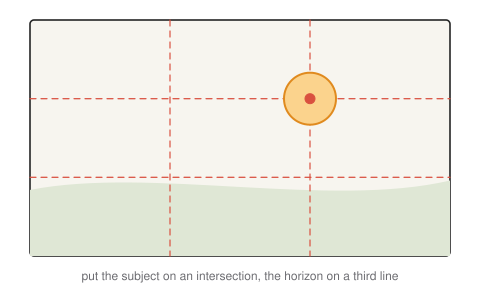

# 12 · Building an interactive graphics project

**You will learn:** how to plan a small real-time graphics project; how to organize time-based and interactive scenes; how to implement common features: particles, skyboxes, text, picking and imported models; how to find out why nothing shows up; and the composition and color principles that make a scene look good.

---

## 12.1 What makes a project stand out

A project that only puts textured shapes on screen and moves them with sine waves is competent but forgettable. Memorable projects usually do at least one of these well:

- **Technique.** Simulate something hard: water, smoke, cloth, crowds, or physically plausible motion with collisions. Implement an effect beyond the basics: shadows, reflections, particles, or procedural terrain.
- **Interaction.** A game mechanic or a control scheme that makes people want to keep playing.
- **Look.** Deliberate composition, a coherent color palette and consistent lighting. An art direction chosen up front beats photorealism reached halfway.

Pick one of these to excel at, and keep the rest simple.

**Advanced features** are techniques beyond transformations, lighting and texturing. For example:

| Feature | Chapter |
|---|---|
| collision detection and physics-based motion | 9 |
| shadows (shadow mapping) | 10 |
| mirrors, render-to-texture, post-processing | 10 |
| bump / normal / parallax mapping | 8 |
| ray tracing or ray casting | 11 |
| particle systems | §12.4 |
| scene graphs with many articulated parts | 4 |
| mouse picking | §12.4 |
| splines and procedural geometry (terrain, surfaces of revolution) | 3 |

Basic lighting, matrix transformations and texturing on their own are expected, not advanced.

## 12.2 Plan it

A one-page proposal answers:

1. **Theme or story.** What is the experience in one sentence?
2. **Course topics used, and how.** Transformations, cameras, lighting, textures…
3. **Interactivity.** What does the user control?
4. **Advanced features.** Which ones, and which is the stretch goal?
5. **Team and roles**, with a rough schedule and a minimal version you are sure you can finish.

Build the **minimal playable version first**: gray boxes, fixed camera, core interaction. Then add look and features in order of impact, keeping it runnable at every step. Commit often.

A schedule for a four-week project might look like this:

| Week | Milestone | If you are behind |
|---|---|---|
| 1 | Gray-box scene, camera and core interaction all working | Cut the idea down now, not in week 4 |
| 2 | The one advanced feature working in isolation, even if ugly | Pick the simpler variant (e.g. a planar shadow instead of a shadow map) |
| 3 | Integrate it; add materials, lighting and palette | Drop the stretch goal |
| 4 | Polish, fix bugs, record the demo; no new features | — |

Write the "if you are behind" column before you start. Deciding what to cut is much easier on day one than the night before the deadline.

## 12.3 Organizing time and state

### Freeze and inspect

Pausing animation time, while the camera and debugger keep working, is the single most useful debugging tool. In TinyGraphics, `program_state.animate = false` stops `animation_time`. Bind it to a key with `key_triggered_button`, or type it into the console while paused at a breakpoint.

It stops **only** `animation_time`. `animation_delta_time` still reports the real time since the last frame, so anything you move by $`\Delta t`$ keeps moving while "paused". Derive your step from the pause flag (see *Frame-rate independence* below).

### Sequencing timed events

For a scripted animation (a short film, an intro sequence), give each part its own clock, offset from global time. Keep the parts in one table, so that the whole timeline can be retimed in one place:

```js
const timeline = [                                  // seconds; each scene starts when the previous one ends
    {name: "intro",   length: 5, draw: p => this.draw_intro(p)},
    {name: "falling", length: 7, draw: p => this.draw_falling(p)},
    {name: "landing", length: 4, draw: p => this.draw_landing(p)},
];

display(context, program_state) {
    let t = program_state.animation_time / 1000;
    for (const scene of timeline) {
        if (t < scene.length) {                     // t is now this scene's local time
            scene.draw(t / scene.length);           // progress 0 → 1 over the scene
            break;
        }
        t -= scene.length;                          // skip past this scene
    }
}
```

Lengthening the intro automatically delays everything after it. Drawing with a *progress* value in $`[0, 1]`$, rather than raw seconds, means a scene's own code does not change when you retime it. To ease in and out instead of moving at constant speed, pass the progress through a smooth curve first, for example $`3p^2 - 2p^3`$.

### Interactive programs: finite-state machines

When input decides what happens next, as in a game, make the program a **finite-state machine**:

```js
const State = {TITLE: 0, PLAYING: 1, GAME_OVER: 2};

display(context, program_state) {
    const now = program_state.animation_time / 1000;
    switch (this.state) {
        case State.TITLE:     this.draw_title(now - this.state_started); break;
        case State.PLAYING:   this.update_and_draw_game(now - this.state_started); break;
        case State.GAME_OVER: this.draw_game_over(now - this.state_started); break;
    }
}

change_state(next, now) {                           // called from key handlers or game logic
    this.state = next;
    this.state_started = now;                       // every state gets its own local clock
}
```

Each state owns its update and draw logic and knows how long it has been active. Transitions happen only through `change_state`.

### Frame-rate independence

Move things by **time**, not by frame count: `position += velocity * dt`. A program written as `position += 0.1` per frame runs twice as fast on a 120 Hz display. In TinyGraphics, compute the step once per frame:

```js
const dt = program_state.animate
    ? Math.min(program_state.animation_delta_time / 1000, 0.1)   // seconds, capped
    : 0;                                                         // paused: nothing moves
```

The cap matters too. The browser stops calling your frame function while the tab is hidden, so the first frame after switching back can report a $`\Delta t`$ of many seconds, and objects jump through walls. For physics, use the fixed-time-step loop from chapter 9.

The same bug hides in **smoothing**. A camera that eases toward a target with `x += (target - x) * 0.1` every frame closes 10% of the gap *per frame*. After a quarter of a second, $`0.9^{15} \approx 0.206`$ of the gap is left at 60 Hz, but only $`0.9^{36} \approx 0.0225`$ at 144 Hz, so on a fast screen the camera snaps to its target much sooner. Write the rate per second instead:

```js
x += (target - x) * (1 - Math.exp(-k * dt));      // k = 6.32 matches the 60 Hz feel
```

The fraction left after time $`t`$ is then $`e^{-kt}`$ on every display: $`e^{-6.32 \cdot 0.25} \approx 0.206`$.

## 12.4 Common features

**Particle systems.** Many small, short-lived sprites (fire, smoke, sparks, rain, magic), each with a position, velocity, age and lifetime. Each frame: spawn new particles, integrate their motion (gravity, drag, wind), fade them by age, and delete dead ones. Render them as camera-facing quads, after all opaque objects, with depth **testing** on (so walls hide them) but depth **writing** off (so they do not hide each other). The blend mode decides whether order matters (chapter 10):

- **Additive**, `gl.blendFunc(gl.SRC_ALPHA, gl.ONE)`: colors only add up, so order does not matter. Right for glowing things: fire, sparks, magic.
- **Alpha "over"**: order matters, so sort particles back to front. Needed for things that darken, such as smoke and dust.

TinyGraphics turns on straight-alpha blending, `gl.blendFunc(gl.SRC_ALPHA, gl.ONE_MINUS_SRC_ALPHA)`, for everything. Switch to additive just before drawing the particles and switch back afterwards. For tens of thousands of particles, keep the state in typed arrays and upload it in one buffer, or move the simulation into a shader. For examples and inspiration, see [Shadertoy](https://www.shadertoy.com/).

**Skybox.** A cube map (chapter 8) sampled by view direction, drawn on a cube around the camera with the **translation removed** from the view matrix: set its last column to $`(0, 0, 0, 1)`$. The sky then turns with the camera but never gets closer. The cube's size does not matter, as long as it lies between the near and far planes. There are two ways to keep it behind everything:

- Draw it **first**, with depth writing off. Everything drawn later covers it.
- Draw it **last**, forced to the far plane: in the vertex shader set `gl_Position = clip.xyww`, so that $`z/w = 1`$, and draw with `gl.depthFunc(gl.LEQUAL)`. This is faster, because the sky's fragment shader only runs on pixels nothing else covered.

**Text and heads-up displays.** There are three common approaches:
- An HTML element positioned over the canvas: simplest, crisp, and styled with CSS.
- Text drawn into a 2D canvas that is then uploaded as a texture.
- A font atlas texture with one quad per character, like TinyGraphics' `Text_Demo`.

A score display that stays fixed on screen should skip the view and projection matrices, or use an orthographic projection matched to the canvas.

**Mouse picking.** Clicking an object means turning a pixel back into a ray in the world, then asking which object the ray hits first. There are three steps.

**Step 1: mouse to NDC.** Measure the mouse relative to the canvas's top-left corner, in CSS pixels:

```math
x_{\text{ndc}} = \frac{2\,x_{\text{mouse}}}{\text{width}} - 1, \qquad y_{\text{ndc}} = 1 - \frac{2\,y_{\text{mouse}}}{\text{height}}.
```

Here width and height must be the canvas's **CSS size** (`getBoundingClientRect()`), not `canvas.width`. TinyGraphics sizes the drawing buffer by `devicePixelRatio`, so on a high-DPI screen `canvas.width` is twice the CSS width. Mixing the two gives a pick that is only correct at the top-left corner.

**Step 2: unproject two points.** The NDC points $`(x, y, -1)`$ and $`(x, y, 1)`$ lie on the near and far planes under the mouse. Multiply each by $`(PV)^{-1}`$, then **divide by** $`w`$. The inverse projection does not return $`w = 1`$, and skipping the division is the most common picking bug.

**Step 3: intersect.** The ray starts at the near point and points toward the far point. Test it against each object's bounding volume (chapter 9) or with the ray–sphere and ray–triangle tests of chapter 11, and keep the smallest positive $`t`$.

```js
canvas.addEventListener("pointerdown", e => {         // program_state: saved from display()
    const rect = canvas.getBoundingClientRect();
    const x = 2 * (e.clientX - rect.left) / rect.width - 1;
    const y = 1 - 2 * (e.clientY - rect.top) / rect.height;
    const inv = Mat4.inverse(program_state.projection_transform.times(program_state.view_transform));
    const unproject = z => { const q = inv.times(vec4(x, y, z, 1)); return q.to3().times(1 / q[3]); };
    const near = unproject(-1), far = unproject(1);
    const ray = {origin: near, direction: far.minus(near).normalized()};
    // ... find the closest object the ray hits
});
```

**Example.** The camera is at $`(0, 0, 5)`$ looking at the origin, with `Mat4.perspective(Math.PI / 2, 1, 1, 11)`. The canvas is 800 × 800 CSS pixels, and the click lands at $`(600, 200)`$, so $`(x_{\text{ndc}}, y_{\text{ndc}}) = (0.5, 0.5)`$.

- Near point: $`(PV)^{-1}(0.5, 0.5, -1, 1) = (0.5, 0.5, 4, 1)`$, already $`w = 1`$.
- Far point: $`(PV)^{-1}(0.5, 0.5, 1, 1) = (0.5, 0.5, -0.5455, 0.0909)`$. Dividing by $`w`$ gives $`(5.5, 5.5, -6)`$.
- The ray direction is $`(5, 5, -10)`$, up and to the right, as the click was. Without the division, the "far point" $`(0.5, 0.5, -0.5455)`$ would give the direction $`(0, 0, -4.5455)`$: straight ahead, whatever was clicked.
- With `canvas.width` = 1600 in place of the CSS width, the same click would map to $`(-0.25, 0.75)`$.

The alternative to rays is **color picking**: render every object in a unique flat color to an off-screen target (chapter 10), and read back the one pixel under the mouse with `gl.readPixels`. It is exact for any shape, but costs an extra render pass.

**Imported models.** Model complex objects in a tool such as [Blender](https://www.blender.org/) and export them as `.obj`. TinyGraphics' `Obj_File_Demo` includes `Shape_From_File`, a minimal `.obj` loader (there is no glTF loader). It is minimal in ways that matter:

- It reads normals from the file and never computes them. Export **with normals** (and with UVs if the model is textured). Without them, lighting comes out black or garbled.
- It handles triangles and quads only. Tick **Triangulate faces** when exporting.
- It re-centers the model on the origin and rescales it to a size of about 1, so your scale and position in Blender are discarded. Place the model with its model matrix instead.
- It loads asynchronously and draws nothing until the file has arrived. The first frames will not show the model.

**Texture baking** in Blender renders expensive lighting, such as ambient occlusion, soft shadows or bounce light, into textures that a simple real-time shader can display.

## 12.5 When nothing shows up

A blank or black canvas is the most common state of a graphics project, and WebGL rarely tells you why. Work through the causes from the cheapest to check:

1. **Read the console.** TinyGraphics throws on a GLSL compile or link error, with the failing line. An exception inside `display` also stops the frame loop.
2. **Serve the page, do not open the file.** From a `file://` URL, modules and textures fail to load. Use a local server (`node tools/serve.mjs`).
3. **Is anything drawing at all?** Change the background color. If it does not change, the frame loop is not running.
4. **Can the camera see the object?** In camera space the camera looks down $`-z`$, and only depths between the near and far planes are drawn. Put a unit cube at the origin with the camera at $`(0, 0, 5)`$ looking at it. If that appears, your own object is too big, too small, behind the camera or outside the clip range.
5. **Is it black instead of missing?** Then the geometry is fine, and the problem is lighting: no lights in `program_state.lights`, the light is inside the object, normals are zero or `NaN` or not transformed by the normal matrix (chapter 7), or the material's ambient and diffuse are both 0. Temporarily output the normal as a color, `vec4(N * 0.5 + 0.5, 1)`, to see them.
6. **Only some faces missing?** If you enabled back-face culling, suspect the winding (chapter 3), including a model matrix that mirrors the object (chapter 4). If the object is cut open as the camera approaches, it is crossing the near plane.
7. **Moves wrong?** Print the matrix and check the multiplication order (chapter 4). Freeze time (§12.3) and step through one frame.
8. **Texture blank or black?** It has not finished loading yet, the image path is wrong (look in the Network tab), or the texture coordinates are all the same value.

Change **one** thing at a time, and go back to the last commit that worked when you are lost.

## 12.6 Making it look good

### Composition



- **Rule of thirds.** Divide the frame into thirds. Put the subject on an intersection and the horizon on a line, not dead center.
- **Symmetry and pattern** read as calm and deliberate. Break a pattern once to draw the eye there.
- **Simplify.** Remove whatever does not support the subject. Empty space is a choice.
- **Depth cues.** Overlap, atmospheric fog (fade distant objects toward the sky color), and lighting that separates foreground from background.

### Color

- Choose a **palette** first, with 3–5 colors, using a scheme:
  - *analogous*: neighbours on the color wheel; calm.
  - *complementary*: opposites; high contrast.
  - *monochromatic*: one hue at different lightness.
  - *triadic*: three hues evenly spaced around the wheel.
- Use **one accent color** for what matters, such as the player, a goal or a danger.
- Warm light with cool shadows, or the reverse, reads as natural and adds depth.
- Tools: [Adobe Color](https://color.adobe.com/create), [Coolors](https://coolors.co/).

### Lighting

Three lights go a long way: a **key** light that defines the shape, a dimmer **fill** light on the other side that lifts the shadows, and a **rim** light from behind that separates the subject from the background.

---

## Check yourself

1. Your animation runs noticeably faster on a friend's 144 Hz laptop. What is the bug and the fix?
2. Design the state machine for a simple game: a title screen, a level you can win or lose, and a results screen with a restart key. Which transitions exist?
3. Your skybox gets closer as you walk toward it. What is wrong?
4. A particle effect of 50,000 sparks drops the frame rate to 5 fps. Name two changes that would help.
5. You set `program_state.animate = false`, and the planets stop orbiting, but the asteroids keep flying. The planets use `animation_time`, the asteroids `position += velocity * dt`. Why, and what is the fix?
6. Picking works on your desktop monitor. On a laptop with a Retina screen, only clicks near the canvas's top-left corner select the right object. What is the bug?
7. Your smoke particles look correct from one side, but from the other side the far puffs are drawn over the near ones. Your fire particles look right from every side. Explain.

<details><summary>Answers</summary>

1. Motion is advanced by a fixed amount per frame. Scale every change by the elapsed time $`\Delta t`$, or use a fixed-time-step simulation loop.
2. The states are TITLE, PLAYING, WON, LOST and RESULTS. The transitions: TITLE → PLAYING on the start key; PLAYING → WON or LOST on the game's condition; WON or LOST → RESULTS after a delay; RESULTS → TITLE, or straight to PLAYING, on the restart key.
3. The skybox is drawn with the full view matrix, including its translation. Remove the translation (use only the rotation part) so the sky stays infinitely far away.
4. Any two of these:
   - Draw all particles in one draw call from a single buffer, instead of one call per particle.
   - Keep particle state in typed arrays and upload it with one `bufferSubData`.
   - Simulate on the GPU.
   - Cap the particle lifetime and count.
   - Use point sprites or instancing.
5. `animate` stops only `animation_time`. `animation_delta_time` keeps reporting real elapsed time, so the asteroids still move. Use `dt = program_state.animate ? program_state.animation_delta_time / 1000 : 0`.
6. The mouse position is in CSS pixels, but it was divided by `canvas.width` and `canvas.height`, which are twice as large on a Retina screen. Every click maps to a point halfway toward the top-left corner in NDC, which is correct only at that corner. Divide by the canvas's CSS size from `getBoundingClientRect()`.
7. Smoke uses alpha "over" blending, which depends on draw order, and the particles are drawn in a fixed order instead of sorted back to front for the current view. Fire uses additive blending, where the order does not change the sum.

</details>

## Further reading

- [WebGL2 Fundamentals: text](https://webgl2fundamentals.org/webgl/lessons/webgl-text-html.html), [skybox](https://webgl2fundamentals.org/webgl/lessons/webgl-skybox.html), [picking](https://webgl2fundamentals.org/webgl/lessons/webgl-picking.html).
- Glenn Fiedler, [*Fix Your Timestep!*](https://gafferongames.com/post/fix_your_timestep/): variable, capped and fixed time steps.
- Bruce Block, *The Visual Story*: composition, space and color for moving images.
- [TinyGraphics.js examples](https://github.com/intro-graphics/TinyGraphics.js/tree/v2/examples): collisions, inertia, text, obj files, render to texture.
